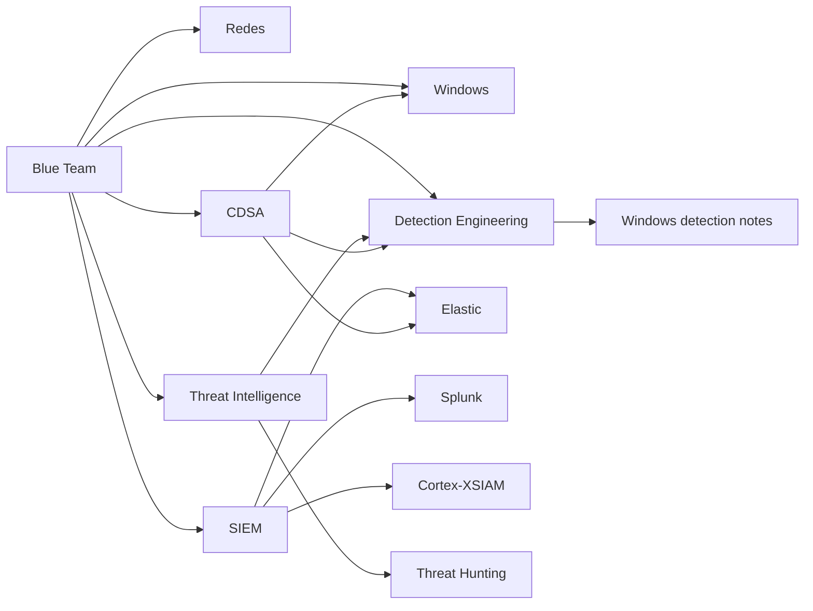

# Blue Team

Mapa principal del área defensiva del repositorio.

## Áreas conectadas

| Área | Qué contiene |
|---|---|
| [[CDSA]] | Preparación de examen final, metodología, hunting y plantillas |
| [[Detection-Engineering]] | Hipótesis de detección, lógica defensiva y equivalencias entre herramientas |
| [[Redes]] | Fundamentos de red para entender tráfico, conectividad y evidencias |
| [[Windows]] | Eventos, seguridad y análisis de sistemas Windows |
| [[SIEM]] | Plataformas SIEM, consultas, detecciones y operación SOC |
| [[Threat-Intelligence]] | Contexto de amenazas, IOCs, TTPs y lectura de reportes |

## Ruta recomendada

Relacionado: [[CDSA]], [[Detection-Engineering]], [[Redes]], [[Windows]], [[SIEM]], [[Threat-Intelligence]], [[Elastic]], [[Splunk]], [[Cortex-XSIAM]].
