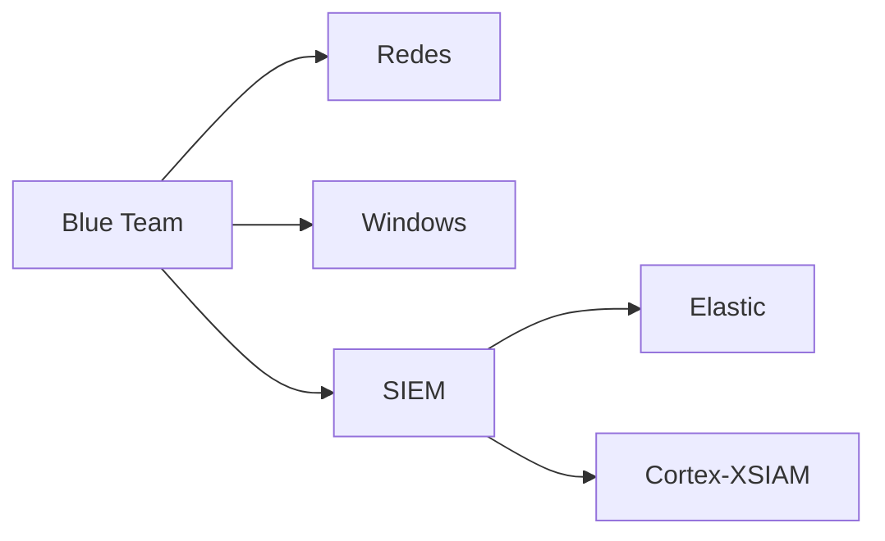

# Blue Team

Mapa principal del área defensiva del repositorio.

## Áreas conectadas

| Área | Qué contiene |
|---|---|
| [[Redes]] | Fundamentos de red para entender tráfico, conectividad y evidencias |
| [[Windows]] | Eventos, seguridad y análisis de sistemas Windows |
| [[SIEM]] | Plataformas SIEM, consultas, detecciones y operación SOC |

## Ruta recomendada

Relacionado: [[Redes]], [[Windows]], [[SIEM]], [[Elastic]], [[Cortex-XSIAM]].

