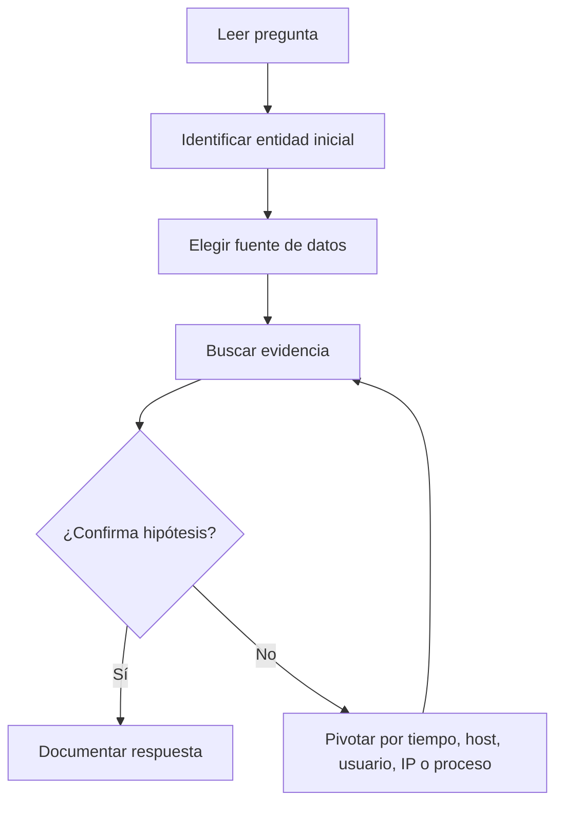

# Examen final y voucher CDSA

## Idea clave

El tramo final de CDSA debe prepararse como una investigación SOC completa, no como un test de memoria.

La meta es demostrar que sabes:

- leer evidencias;
- pivotar entre fuentes;
- formular hipótesis;
- validar o descartar actividad sospechosa;
- documentar respuestas de forma clara;
- justificar decisiones con datos.

> [!WARNING]
> No asumir condiciones exactas del examen o del voucher desde apuntes personales. Duración, intentos, validez, reglas, entorno y formato pueden cambiar. Validar siempre en Hack The Box Academy antes de usar el voucher.

## Datos públicos importantes

| Punto | Valor a tener en cuenta |
|---|---|
| Ventana de examen | 7 días desde el inicio |
| Reporte | Obligatorio, profesional y en inglés |
| Formato de entrega | PDF/ZIP sin contraseña, máximo 20 MB |
| Evaluación | Puntos/flags + calidad del informe |
| Resultado | Hasta 20 días laborables |
| Voucher | Validez general de 1 año |
| Retake | Requiere entregar reporte en el primer intento |

Más detalle en [[03-estructura-y-reglas-examen-cdsa]] y [[fuentes-cdsa]].

## Qué significa prepararse bien

Prepararse bien no es memorizar todos los comandos. Es tener un método estable.

| Bloque | Objetivo |
|---|---|
| SIEM | Buscar, filtrar, ordenar y pivotar |
| Windows | Entender procesos, usuarios, logs y Sysmon |
| Red | Leer conexiones, DNS, HTTP, SSL y patrones raros |
| CTI | Interpretar IOCs y TTPs sin tragarlos sin validar |
| Hunting | Transformar una pista en búsquedas concretas |
| Documentación | Responder con evidencia, no con intuición |

## Antes de activar el voucher

Checklist recomendado:

- He repasado los módulos principales.
- He practicado búsquedas en [[Elastic]] y [[Kibana]].
- Entiendo los eventos básicos de [[Windows]] y [[conceptos-basicos-sysmon]].
- Sé leer evidencias de [[Zeek]] a alto nivel.
- Tengo clara la diferencia entre IOC, TTP, alerta y evidencia.
- Sé documentar un hallazgo en formato breve.
- He preparado mi entorno de notas.
- He validado condiciones oficiales del voucher.
- He leído [[03-estructura-y-reglas-examen-cdsa]].
- He preparado la estrategia de [[04-estrategia-7-dias-cdsa]].

> [!TIP]
> Si todavía dependes de copiar consultas sin entender qué campo estás usando, espera antes de consumir el voucher. Practica pivotes pequeños hasta poder explicar cada paso.

## Durante el examen

Regla práctica:

```text
Leer -> Hipótesis -> Buscar -> Pivotar -> Confirmar -> Documentar
```

No saltes directamente a responder. Primero entiende:

- qué pregunta te hacen;
- qué entidad inicial tienes;
- qué rango temporal aplica;
- qué fuente de datos contiene la evidencia;
- qué campo permite pivotar;
- qué dato confirma la respuesta.

## Gestión del tiempo



## Errores típicos

| Error | Cómo evitarlo |
|---|---|
| Buscar sin rango temporal | Acotar por tiempo desde el principio |
| Confiar en un IOC aislado | Validar contexto y comportamiento |
| No anotar pivotes | Registrar campo, valor y fuente |
| Confundir host con usuario | Separar entidad, acción y evidencia |
| Responder sin prueba | Guardar evento, campo o captura mental clara |
| Bloquearse con una query | Volver a la pregunta y simplificar |

## Regla mental

```text
En CDSA gana quien investiga ordenado, no quien memoriza más comandos.
```

Relacionado: [[CDSA]], [[01-metodologia-investigacion-cdsa]], [[02-checklist-hunting-elastic-windows-zeek]], [[03-estructura-y-reglas-examen-cdsa]], [[04-estrategia-7-dias-cdsa]], [[plantilla-respuesta-examen-cdsa]].
