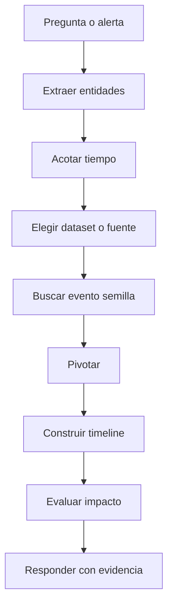

# Metodología de investigación CDSA

## Objetivo

Tener un flujo repetible para resolver preguntas de investigación en un entorno SOC/lab.

> [!NOTE]
> La metodología sirve aunque cambie la herramienta. Puedes aplicarla en [[Elastic]], [[Cortex-XSIAM]], Sentinel, EDR o revisión local con [[get-winevent]].

## Flujo principal



## 1. Extraer entidades

Busca en la pregunta:

| Entidad | Ejemplos |
|---|---|
| Host | nombre de equipo, IP, asset |
| Usuario | cuenta local, dominio, service account |
| Proceso | `powershell.exe`, `cmd.exe`, `rundll32.exe` |
| Red | IP origen, IP destino, dominio, URL |
| Archivo | nombre, ruta, hash |
| Tiempo | timestamp, ventana temporal, secuencia |

## 2. Elegir fuente de datos

| Pregunta | Fuente probable |
|---|---|
| ¿Qué proceso se ejecutó? | Sysmon ID 1, EDR process events, Elastic endpoint |
| ¿Hubo conexión de red? | Sysmon ID 3, Zeek `conn`, firewall, EDR network |
| ¿Qué dominio consultó? | DNS logs, Zeek `dns`, EDR DNS |
| ¿Qué usuario inició sesión? | Windows Security, autenticación, EDR |
| ¿Se cargó una DLL rara? | Sysmon ID 7, image load events |
| ¿Hubo acceso a LSASS? | Sysmon ID 10, EDR credential access |

## 3. Pivotar con cabeza

Pivotes frecuentes:

- host -> procesos;
- proceso -> command line;
- proceso -> conexiones;
- usuario -> logons;
- IP -> DNS/HTTP/SSL;
- hash -> host afectado;
- timestamp -> eventos alrededor;
- parent process -> árbol de ejecución.

> [!TIP]
> Si te pierdes, vuelve al timestamp y reconstruye una mini línea temporal. El tiempo suele ordenar la historia.

## 4. Construir timeline

Formato mínimo:

| Hora | Entidad | Acción | Fuente |
|---|---|---|---|
| `HH:MM:SS` | host/usuario/proceso | qué pasó | dataset/log |

Busca responder:

- ¿qué ocurrió primero?
- ¿qué proceso inició la cadena?
- ¿hubo actividad posterior?
- ¿hay conexión externa?
- ¿hay persistencia o impacto?

## 5. Decidir

| Señal | Lectura |
|---|---|
| IOC exacto sin más contexto | Pista |
| Proceso raro + ruta rara + red | Sospechoso |
| PowerShell ofuscado + descarga | Alto interés |
| Acceso a LSASS desde ruta de usuario | Muy sospechoso |
| Actividad esperada de software corporativo | Posible falso positivo |

## 6. Responder

Una buena respuesta incluye:

- dato pedido;
- evidencia concreta;
- fuente donde aparece;
- contexto mínimo;
- si aplica, por qué es relevante.

Ejemplo:

```text
El host afectado es WORKSTATION-01. La evidencia aparece en eventos de proceso: powershell.exe ejecutó una command line ofuscada a las 10:42:13 y posteriormente realizó conexión a 203.0.113.10.
```

Relacionado: [[CDSA]], [[02-checklist-hunting-elastic-windows-zeek]], [[05-comparativa-get-winevent-etw-sysmon]], [[06-elastic-hunting-stuxbot-windows-zeek-cdsa]].

