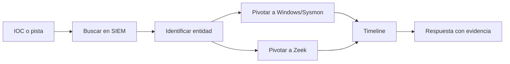

# Checklist hunting Elastic, Windows y Zeek para CDSA

## Objetivo

Checklist rápido para buscar evidencias típicas en un escenario defensivo con [[Elastic]], [[Kibana]], [[Splunk]], [[Windows]], [[conceptos-basicos-sysmon]] y [[Zeek]].

> [!WARNING]
> Los nombres exactos de índices y campos pueden variar según el laboratorio, parser, integración o versión. Validar siempre con los campos disponibles en el entorno.

## Búsquedas iniciales

| Qué necesito | Qué revisar |
|---|---|
| Ventana temporal | Rango de tiempo global en Kibana |
| Host afectado | hostname, IP, asset name |
| Usuario | account name, domain, user.name |
| Proceso inicial | process.name, process.command_line, parent |
| Red | source/destination IP, port, protocol |
| DNS/HTTP | domain, URL, user-agent |
| Archivo | file.name, file.path, hash |

## Windows y Sysmon

| Caso | Evento/fuente | Señales |
|---|---|---|
| Creación de proceso | Sysmon ID 1 | proceso, padre, command line, usuario |
| Conexión de red | Sysmon ID 3 | proceso, destino, puerto |
| Carga de DLL | Sysmon ID 7 | DLL desde ruta rara, firma ausente |
| Acceso a proceso | Sysmon ID 10 | acceso a `lsass.exe` |
| Creación de archivo | Sysmon ID 11 | dropper, payload, ruta temporal |
| DNS | Sysmon ID 22 / DNS logs | dominios raros, DGA, C2 |

## PowerShell

Buscar:

- `-enc`;
- `EncodedCommand`;
- `IEX`;
- `DownloadString`;
- `FromBase64String`;
- ejecución desde rutas de usuario;
- proceso padre raro;
- conexiones de red posteriores.

> [!TIP]
> PowerShell no es malicioso por sí mismo. La sospecha nace del contexto: usuario, host, command line, origen, destino y actividad posterior.

## Zeek

| Log | Qué aporta |
|---|---|
| `conn` | conexiones, IPs, puertos, duración, bytes |
| `dns` | consultas DNS y respuestas |
| `http` | URLs, métodos, user-agent, hosts |
| `ssl` / `x509` | certificados, SNI, fingerprints |
| `files` | ficheros observados en red |

Pivotes útiles:

- IP interna -> conexiones externas;
- dominio -> IP resuelta;
- IP destino -> HTTP/SSL asociado;
- user-agent raro -> host afectado;
- timestamp de red -> proceso cercano en Windows.

## Elastic/Kibana

Buenas prácticas:

- Acotar tiempo antes de buscar.
- Empezar amplio y luego filtrar.
- Revisar campos disponibles antes de escribir consultas complejas.
- Usar tablas para comparar eventos.
- Ordenar por timestamp.
- Guardar valores clave: host, usuario, proceso, IP, dominio, hash.

## Splunk/SPL

Buenas prácticas:

- Empezar por `index`, `sourcetype` y rango temporal.
- Usar `table` para aislar campos útiles.
- Usar `stats count by` para entender frecuencia.
- Usar `rex` cuando necesites extraer campos de texto.
- Usar `lookup` como enriquecimiento, no como veredicto.
- Acotar antes de usar `transaction`.

## Mini flujo de hunting



## Señales de alto interés

- Proceso de Office lanzando PowerShell o CMD.
- PowerShell ofuscado con conexión externa.
- `rundll32.exe`, `regsvr32.exe`, `mshta.exe` o `wscript.exe` con argumentos raros.
- Acceso a `lsass.exe` desde proceso no esperado.
- Dump de LSASS: separar `SourceImage`, `TargetImage`, `CallTrace` y `TargetFilename`.
- Conexiones a dominios recién vistos o raros.
- Descarga de ejecutable seguida de ejecución.
- Actividad de red justo después de un proceso sospechoso.

## Regla mental

```text
Endpoint explica qué se ejecutó.
Red explica con quién habló.
Tiempo une las dos historias.
```

Relacionado: [[CDSA]], [[01-metodologia-investigacion-cdsa]], [[07-estrategia-lsass-dump-examen]], [[06-elastic-hunting-stuxbot-windows-zeek-cdsa]], [[Elastic]], [[Kibana]], [[Splunk]], [[Zeek]], [[Windows]].
