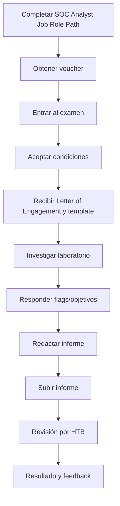

# Estructura y reglas del examen CDSA

Investigado el 2026-08-13. Actualizado el 2026-08-14 con confirmación de HTB Support sobre monitoring.

## Idea clave

El examen **HTB Certified Defensive Security Analyst (CDSA)** es un examen práctico de análisis defensivo, operación SOC e incident handling.

No está planteado como un test de preguntas tipo multiple choice. El valor está en investigar un entorno, responder objetivos/flags y entregar un informe profesional con evidencias.

> [!WARNING]
> Esta nota resume información pública consultada el 2026-08-13. Validar siempre en Hack The Box Academy antes de iniciar el examen o consumir el voucher.

## Datos confirmados por fuentes oficiales

| Punto | Resumen |
|---|---|
| Duración | 7 días desde que se inicia el examen |
| Tipo | Práctico, hands-on, orientado a SOC/incident handling |
| Acceso | Entorno de laboratorio dedicado |
| Entregables | Flags/objetivos en la página del examen e informe profesional |
| Reporte | Obligatorio, en inglés, usando plantilla/flujo oficial |
| Revisión | Instructor de HTB revisa puntos mínimos y calidad del informe |
| Resultado | Hasta 20 días laborables |
| Voucher | Validez general de 1 año |
| Segundo intento | Requiere haber entregado reporte en el primer intento |
| Monitoring/proctoring | HTB Support confirmó que CDSA no requiere equipo de monitorización |

## Confirmación oficial por soporte

HTB Support confirmó por email el 2026-08-13:

- CDSA no requiere equipo de monitorización.
- La ventana de examen es de 7 días.
- Los 7 días incluyen la redacción del reporte.

> [!NOTE]
> Esta confirmación resuelve la duda operativa sobre cámara/proctoring. Aun así, antes de iniciar el examen conviene revisar el dashboard y condiciones vigentes de HTB Academy.

## Flujo oficial del examen

## Lo que HTB espera evaluar

Según la descripción oficial, CDSA evalúa competencia técnica en:

- security analysis;
- operaciones SOC;
- incident handling;
- identificación de incidentes activos;
- reconocimiento de tácticas de evasión;
- elaboración de informes efectivos.

## Prerrequisitos prácticos

HTB menciona como capacidades relevantes:

| Capacidad | Traducción práctica para estudiar |
|---|---|
| Interpretar una Letter of Engagement | Entender alcance, objetivos y restricciones |
| Conocer fundamentos web/infra | Saber qué significa una evidencia técnica |
| Conocer OS y redes | Windows, procesos, autenticación, DNS, HTTP, conexiones |
| Navegar grandes volúmenes de datos | Filtrar, ordenar, pivotar, reducir ruido |
| Entender fuentes de datos | Saber cuándo usar SIEM, endpoint, red, artefactos |
| Hacer análisis manual y automatizado | Consultas, herramientas DFIR, revisión de logs |
| Comunicar incidentes | Informe claro, ejecutivo y técnico |

## Laboratorio y entorno

La información oficial indica:

- el laboratorio es dedicado para cada candidato;
- la ventana de examen empieza al entrar/confirmar;
- se proporciona una Letter of Engagement con alcance, requisitos y objetivos;
- se proporciona una plantilla de reporte;
- se deben enviar flags/objetivos en la página del examen;
- el laboratorio y el deadline aparecen en la página del examen.

> [!NOTE]
> Si algo falla a nivel técnico, soporte puede ayudar con problemas de plataforma, pero no con pistas del examen.

## Reporte

El reporte no es un trámite. Forma parte de la evaluación.

Requisitos operativos confirmados:

| Punto | Requisito |
|---|---|
| Idioma | Inglés |
| Formato | PDF sin cifrar o ZIP sin contraseña |
| Tamaño | Máximo 20 MB |
| Entrega | Solo desde el dashboard oficial del examen |
| Cambios posteriores | Una vez enviado, no se puede cambiar |
| Efecto del envío | El envío final cierra la ventana/lab del examen |

> [!WARNING]
> No enviar hasta haber revisado flags, informe, anexos, capturas, nombres de archivo y tamaño. La entrega final no es reversible.

## Segundo intento

Puntos importantes:

- El voucher incluye intentos según las reglas vigentes de HTB.
- Para conservar la opción de retake, hay que completar el intento y entregar el reporte.
- Si no se entrega reporte en el primer intento, se pierde la elegibilidad del segundo intento.
- Tras recibir feedback, existe una ventana limitada para iniciar el segundo intento.

> [!WARNING]
> No abandonar un intento sin entregar reporte. Aunque no se pase, entregar el informe protege la opción de retake según la documentación oficial consultada.

## Voucher

Información oficial relevante:

- los vouchers de examen de HTB Academy tienen validez de 1 año;
- si vienen de suscripción anual, pueden expirar con la suscripción;
- se puede iniciar antes de que expire;
- HTB recomienda no apurar al último minuto por posibles problemas técnicos.

## Experiencia comunitaria no oficial

Reviews públicas coinciden en varias recomendaciones:

- preparar el examen como una investigación DFIR/SOC de varios días;
- documentar desde el minuto uno;
- tomar capturas de evidencias importantes;
- guardar consultas, comandos y pivotes usados;
- no dejar el informe para el último día;
- dedicar mucho tiempo a la redacción;
- repasar módulos concretos cuando una pregunta se atasca.

> [!WARNING]
> Algunos detalles publicados por estudiantes, como número exacto de incidentes, número de preguntas o umbral de flags, pueden cambiar. Usarlos solo como orientación, no como regla.

## Lectura operativa para Sergio

Prepararía el examen como tres trabajos paralelos:

1. **Investigación:** encontrar evidencias y responder objetivos.
2. **Timeline:** reconstruir qué pasó, cuándo, dónde y con qué impacto.
3. **Reporte:** explicar de forma profesional la historia del incidente.

La trampa mental es pensar que cuando tienes flags ya está todo. En CDSA, el reporte pesa mucho.

## Relacionado

- [[CDSA]]
- [[00-examen-final-y-voucher-cdsa]]
- [[04-estrategia-7-dias-cdsa]]
- [[05-experiencias-comunidad-y-temas-cdsa]]
- [[06-compartir-confirmacion-monitoring-cdsa]]
- [[plantilla-respuesta-examen-cdsa]]
- [[fuentes-cdsa]]
