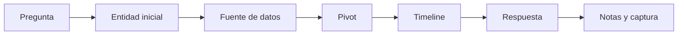

# Estrategia de 7 días para CDSA

## Idea clave

CDSA no se gana solo investigando. Se gana investigando **y documentando bien** dentro de una ventana de 7 días.

> [!WARNING]
> Esta estrategia no describe contenido interno del examen. Es una metodología de gestión de tiempo basada en información oficial y experiencias públicas no oficiales.

## Antes de empezar

No iniciar el examen si falta alguno de estos puntos:

- entorno estable de internet;
- bloc de notas preparado;
- plantilla de reporte lista;
- conocimiento básico de [[Elastic]], [[Kibana]], [[Windows]], [[Zeek]] y [[conceptos-basicos-sysmon]];
- descanso razonable;
- calendario con bloques de tiempo protegidos;
- lectura previa de reglas oficiales de examen/voucher.

## Día 0 - Preparación

Antes de pulsar inicio:

| Acción | Motivo |
|---|---|
| Revisar fecha de expiración del voucher | Evitar sorpresas |
| Validar reglas oficiales | No depender de memoria |
| Preparar plantilla propia de notas | Ahorrar tiempo |
| Crear estructura de carpetas local | Separar evidencias, consultas y reporte |
| Repasar metodología | Entrar con flujo claro |

Estructura sugerida:

```text
CDSA-exam/
├── incident-1/
│   ├── notes.md
│   ├── queries.md
│   └── evidence/
├── incident-2/
│   ├── notes.md
│   ├── queries.md
│   └── evidence/
└── report/
```

## Día 1 - Reconocimiento del entorno

Objetivo: entender dónde están los datos y cómo se responde.

Checklist:

- leer Letter of Engagement;
- identificar alcance;
- revisar objetivos/flags;
- explorar herramientas disponibles;
- identificar SIEM/data views;
- ubicar fuentes Windows, red, endpoint y artefactos;
- crear una tabla de entidades iniciales;
- no empezar el informe demasiado tarde.

> [!TIP]
> La primera hora no es para correr. Es para entender el mapa. Esa hora suele ahorrar muchas después.

## Días 1-3 - Investigación principal

Objetivo: obtener evidencias sólidas.

Flujo:



Cada hallazgo debe guardar:

- pregunta relacionada;
- fuente;
- timestamp;
- filtro/query;
- evidencia;
- interpretación;
- captura si aporta valor.

## Día 3-5 - Reporte en paralelo

No esperes a resolver todo para escribir.

El informe debe ir creciendo con:

- executive summary;
- alcance;
- metodología;
- timeline;
- análisis técnico;
- evidencias;
- impacto;
- recomendaciones;
- anexos o queries relevantes.

> [!WARNING]
> Muchas experiencias públicas coinciden en que el reporte consume más tiempo del esperado. Tratarlo como entregable principal, no como resumen final.

## Día 5-6 - Cierre técnico

Objetivo:

- revisar preguntas pendientes;
- validar respuestas dudosas;
- comprobar que cada conclusión tiene evidencia;
- completar huecos del timeline;
- eliminar suposiciones débiles;
- revisar coherencia entre incidentes, si aplica.

## Día 7 - Revisión y entrega

Checklist final:

- reporte en inglés;
- PDF/ZIP correcto;
- sin contraseña;
- menor de 20 MB;
- capturas legibles;
- queries copiadas sin errores;
- respuestas alineadas con evidencias;
- nombres de hosts, usuarios, IPs y hashes revisados;
- conclusión ejecutiva clara;
- recomendaciones accionables;
- archivo final abierto y revisado antes de subir.

> [!WARNING]
> La entrega final desde el dashboard cierra el examen y no permite reemplazar el archivo. No subir una versión provisional.

## Distribución de esfuerzo recomendada

| Trabajo | Porcentaje |
|---|---:|
| Investigación y pivotes | 45% |
| Documentación del informe | 35% |
| Validación de respuestas | 10% |
| Revisión final | 10% |

## Qué practicar antes

| Área | Práctica |
|---|---|
| Elastic/Kibana | filtros por tiempo, host, usuario, proceso, IP, dominio |
| Windows/Sysmon | procesos, padres, command line, logons, DLLs, LSASS |
| Zeek | `conn`, `dns`, `http`, `ssl`, `files` |
| CTI | IOCs vs TTPs, relevancia, falsos positivos |
| Reporting | informe ejecutivo + análisis técnico con evidencias |

## Regla mental

```text
Cada respuesta debe poder defenderse con una evidencia concreta.
```

```text
Cada evidencia debe tener fuente, timestamp e interpretación.
```

## Relacionado

- [[CDSA]]
- [[03-estructura-y-reglas-examen-cdsa]]
- [[01-metodologia-investigacion-cdsa]]
- [[02-checklist-hunting-elastic-windows-zeek]]
- [[plantilla-respuesta-examen-cdsa]]

