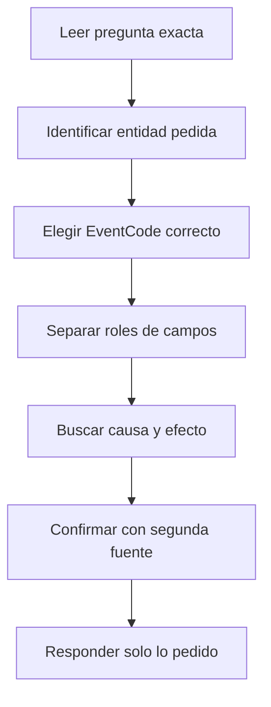

# Estrategia para encontrar dumps de LSASS en el examen

## Idea clave

Cuando una pregunta del examen habla de **dump de LSASS**, no busques el dato más raro. Busca primero **qué entidad te pide la pregunta**.

La trampa habitual es ver campos llamativos como `CallTrace`, `UNKNOWN`, `comsvcs.dll`, `dbgcore.dll` o un `.dmp`, y responder eso aunque la pregunta pida otra cosa.

> [!NOTE]
> Para CDSA: la respuesta suele ser un campo concreto. Primero identifica el campo que responde a la pregunta; después usa el resto como evidencia.

## Secuencia mental



## 1. Lee exactamente qué pide

Antes de escribir la query, traduce la pregunta:

| Pregunta pide... | Campo probable |
|---|---|
| proceso que hizo el dump | `SourceImage` |
| proceso objetivo | `TargetImage` |
| archivo dump creado | `TargetFilename` |
| usuario que ejecutó | `SourceUser` / `User` |
| host afectado | `host` / `ComputerName` |
| técnica o módulo usado | `CallTrace` / `CommandLine` |

Ejemplo:

```text
Which process dumped LSASS?
```

Respuesta esperada:

```text
SourceImage, por ejemplo rundll32.exe
```

No respondas:

- `lsass.exe`;
- `comsvcs.dll`;
- `UNKNOWN`;
- ruta del `.dmp`;
- dirección de memoria;
- DLL cargada.

## 2. Identifica el evento correcto

| Evidencia buscada | Sysmon EventCode | Lectura |
|---|---:|---|
| Un proceso accede a LSASS | `10` | ProcessAccess |
| Se crea un dump en disco | `11` | FileCreate |
| Se ejecuta herramienta/comando | `1` | ProcessCreate |
| Se carga una DLL | `7` | ImageLoaded |

Regla rápida:

```text
Acceso a LSASS = EventCode 10
Dump en disco = EventCode 11
Proceso/comando = EventCode 1
DLL/módulo = EventCode 7
```

## 3. Separa roles de campos

| Campo | Rol mental | Ejemplo |
|---|---|---|
| `SourceImage` | quién realiza la acción | `rundll32.exe` |
| `TargetImage` | sobre qué actúa | `lsass.exe` |
| `CallTrace` | cómo se realizó | `comsvcs.dll`, `dbgcore.dll`, `UNKNOWN` |
| `TargetFilename` | qué archivo se creó | `lsass.dmp` |
| `CommandLine` | comando ejecutado | argumentos de `rundll32` |
| `host` | dónde lo vio Splunk | endpoint/lab host |
| `ComputerName` | equipo según evento Windows | host del evento |

> [!TIP]
> Si te confundes, verbaliza la frase: “`SourceImage` hizo algo contra `TargetImage` usando/mostrando `CallTrace`”.

## 4. Query mínima para encontrar acceso a LSASS

```spl
index=* EventCode=10 TargetImage="*lsass.exe"
| table _time host SourceImage TargetImage GrantedAccess CallTrace
```

Si no sabes si el campo está parseado:

```spl
index=* EventCode=10 lsass
| table _time host SourceImage TargetImage GrantedAccess CallTrace _raw
```

## 5. Buscar el proceso candidato

Agrupa por proceso origen:

```spl
index=* EventCode=10 TargetImage="*lsass.exe"
| stats count by SourceImage
| sort - count
```

Pero cuidado:

```text
Más frecuente no siempre es más malicioso.
Más raro no siempre es la respuesta.
```

Luego revisa candidatos sospechosos:

```spl
index=* EventCode=10 TargetImage="*lsass.exe"
| table _time host SourceImage SourceUser TargetImage GrantedAccess CallTrace
| sort _time
```

## 6. Indicios fuertes de dump

Combinaciones de alto peso:

| Señal | Por qué importa |
|---|---|
| `rundll32.exe` accede a `lsass.exe` | LOLBin habitual para ejecutar funciones de DLL |
| `CallTrace` contiene `comsvcs.dll` | DLL legítima abusada para MiniDump |
| `CallTrace` contiene `dbgcore.dll` / `dbghelp.dll` | componentes usados en operaciones de dump/debug |
| `GrantedAccess` alto | puede permitir lectura amplia del proceso |
| proceso no esperado accediendo a LSASS | comportamiento raro |
| evento cercano de `.dmp` | confirma creación de dump en disco |

Ejemplo mental:

```text
rundll32.exe + lsass.exe + comsvcs.dll/dbgcore.dll + .dmp cercano = evidencia fuerte de dump
```

## 7. Confirmar con EventCode 11

Busca creación de archivo dump cerca del acceso:

```spl
index=* EventCode=11 (TargetFilename="*.dmp" OR TargetFilename="*lsass*")
| table _time host Image TargetFilename
| sort _time
```

Si quieres cruzarlo por proceso:

```spl
index=* (EventCode=10 OR EventCode=11) (TargetImage="*lsass.exe" OR TargetFilename="*.dmp" OR TargetFilename="*lsass*")
| table _time host EventCode SourceImage Image TargetImage TargetFilename CallTrace
| sort _time
```

Lectura:

```text
EventCode 10 me dice quién tocó LSASS.
EventCode 11 me dice si apareció el dump en disco.
```

## 8. Query mínima para responder “qué proceso hizo el dump”

```spl
index=* EventCode=10 TargetImage="*lsass.exe" (CallTrace="*comsvcs.dll*" OR CallTrace="*dbgcore.dll*" OR CallTrace="*dbghelp.dll*")
| stats count by SourceImage
| sort - count
```

Si la respuesta esperada es solo el binario:

```spl
index=* EventCode=10 TargetImage="*lsass.exe" (CallTrace="*comsvcs.dll*" OR CallTrace="*dbgcore.dll*" OR CallTrace="*dbghelp.dll*")
| rex field=SourceImage "(?<process>[^\\\]+)$"
| stats count by process
| sort - count
```

## 9. Errores típicos

| Error | Por qué falla |
|---|---|
| Responder `lsass.exe` | Es el objetivo, no quien hizo el dump |
| Responder `comsvcs.dll` | Es evidencia/técnica, no proceso origen |
| Responder `UNKNOWN` | Es pista de memoria/call trace, no entidad pedida |
| Mirar solo `EventCode=11` | Ves archivo creado, pero quizá no quién accedió a LSASS |
| Mirar solo frecuencia | Puedes elegir proceso benigno frecuente |
| No revisar la pregunta | Puedes contestar campo equivocado |
| No ordenar por tiempo | Pierdes causa y efecto |

## 10. Estrategia causa-efecto

```text
Proceso creado -> acceso a LSASS -> dump creado -> actividad posterior
```

Queries por fase:

```spl
index=* EventCode=1
| table _time host Image CommandLine ParentImage User
| sort _time
```

```spl
index=* EventCode=10 TargetImage="*lsass.exe"
| table _time host SourceImage TargetImage GrantedAccess CallTrace
| sort _time
```

```spl
index=* EventCode=11 (TargetFilename="*.dmp" OR TargetFilename="*lsass*")
| table _time host Image TargetFilename
| sort _time
```

## 11. Cómo responder en examen

Si la pregunta pide:

```text
What process dumped LSASS?
```

Y ves:

```text
SourceImage = C:\Windows\System32\rundll32.exe
TargetImage = C:\Windows\System32\lsass.exe
CallTrace contains comsvcs.dll / dbgcore.dll
```

Responde:

```text
rundll32.exe
```

No añadas contexto salvo que el campo de respuesta lo pida.

## Regla práctica

```text
No elijas el dato más raro.
Elige el campo que responde a la pregunta.
Usa los datos raros para demostrarlo.
```

```text
SourceImage = quién.
TargetImage = a quién.
CallTrace = cómo.
TargetFilename = qué archivo.
```

## Relacionado

- [[CDSA]]
- [[02-checklist-hunting-elastic-windows-zeek]]
- [[02-deteccion-credential-dumping-lsass]]
- [[02-deteccion-intrusion-splunk-escenario-real]]
- [[conceptos-basicos-sysmon]]
- [[Splunk]]

