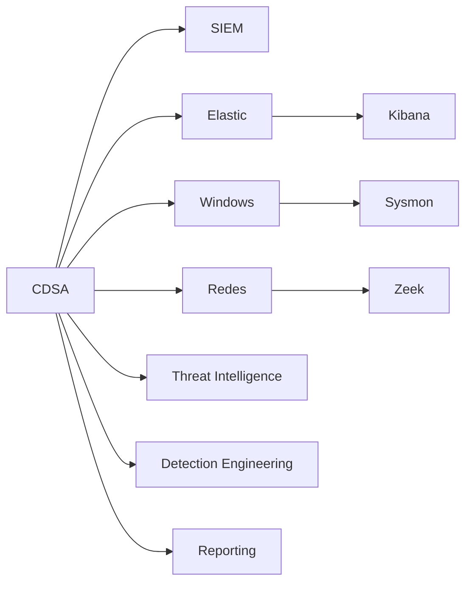

# CDSA

Mapa de preparación para el examen final de **HTB Certified Defensive Security Analyst (CDSA)** y uso del voucher.

> [!WARNING]
> Esta sección es una guía de estudio personal. El formato exacto del examen, condiciones del voucher, tiempos, intentos y requisitos pueden cambiar. Validar siempre en la documentación oficial de Hack The Box Academy antes de reservar o iniciar el examen.

## Entradas principales

| Nota | Uso |
|---|---|
| [[00-examen-final-y-voucher-cdsa]] | Entender cómo preparar el tramo final sin asumir detalles no verificados |
| [[01-metodologia-investigacion-cdsa]] | Método paso a paso para investigar evidencias durante el examen |
| [[02-checklist-hunting-elastic-windows-zeek]] | Checklist práctico para hunting con Elastic, Windows, Sysmon, PowerShell y Zeek |
| [[03-estructura-y-reglas-examen-cdsa]] | Estructura pública del examen, reglas oficiales y puntos a validar |
| [[04-estrategia-7-dias-cdsa]] | Estrategia de gestión del tiempo durante la ventana de examen |
| [[05-experiencias-comunidad-y-temas-cdsa]] | Temas recurrentes publicados por la comunidad sin spoilers |
| [[06-compartir-confirmacion-monitoring-cdsa]] | Dónde compartir la confirmación de HTB sobre monitoring |
| [[plantilla-respuesta-examen-cdsa]] | Plantilla para documentar respuestas y evidencias |
| [[fuentes-cdsa]] | Fuentes oficiales y comunitarias consultadas |

## Mapa mental

Relacionado: [[Blue-Team]], [[SIEM]], [[Elastic]], [[Kibana]], [[Windows]], [[conceptos-basicos-sysmon]], [[Zeek]], [[Threat-Intelligence]], [[Detection-Engineering]], [[security-incident-reporting|Security Incident Reporting]].
