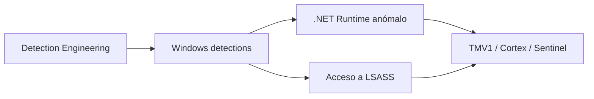

# Detection Engineering

## Idea clave

Detection Engineering convierte hipótesis de amenaza en lógica defensiva operable por un SOC.

No se trata solo de crear una alerta. Se trata de documentar:

- Qué comportamiento se quiere detectar.
- Qué datos lo evidencian.
- Qué campos debe revisar el analista.
- Qué falsos positivos son esperables.
- Cómo se ve en distintas herramientas.
- Cómo se decide si es TP, FP o Benign TP.

## Windows

| Nota | Uso |
|---|---|
| [[00-managed-vs-native-code]] | Diferenciar código nativo, administrado y señales defensivas |
| [[01-deteccion-dotnet-runtime-anomalo]] | Detectar carga anómala del runtime .NET |
| [[02-deteccion-credential-dumping-lsass]] | Investigar acceso sospechoso a LSASS |
| [[03-equivalencias-tmv1-cortex-sentinel]] | Mapear conceptos entre TMV1, Cortex y Sentinel |

## Mapa visual

Relacionado: [[Blue-Team]], [[Windows]], [[SIEM]], [[Cortex-XSIAM]], [[Elastic]].

