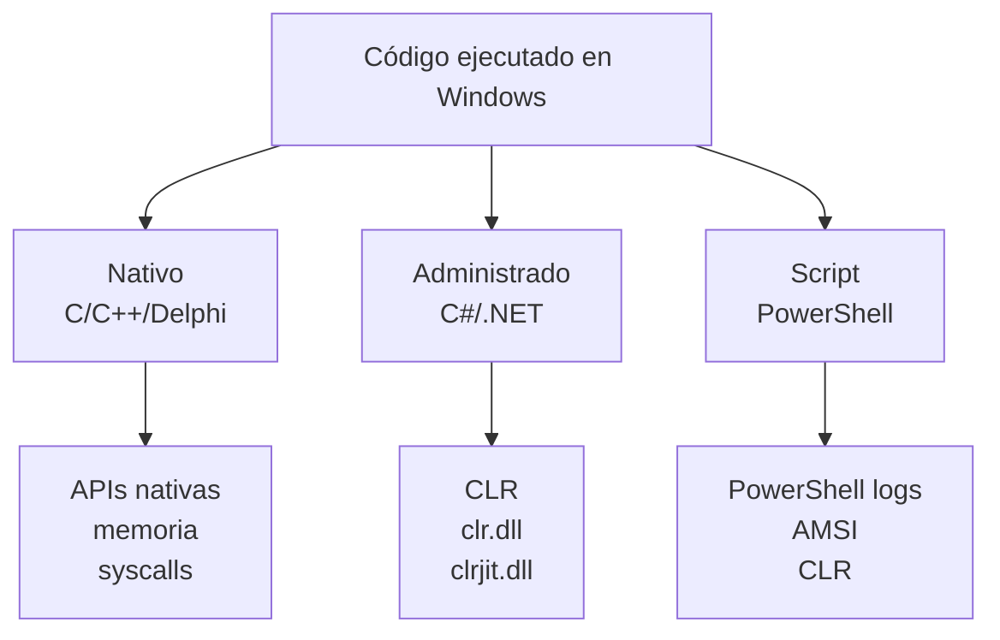

# Managed vs Native Code

## Idea clave

`.NET no es malo. Lo sospechoso es que un proceso que normalmente no necesita .NET cargue componentes del runtime .NET.`

Para investigar bien, primero hay que distinguir entre código nativo, código administrado y scripts basados en .NET.

## Explicación sencilla

C# suele ejecutarse sobre .NET. .NET utiliza el CLR, Common Language Runtime, que actúa como entorno de ejecución para código administrado.

Cuando un proceso ejecuta código .NET/C#, puede cargar DLLs como:

- `clr.dll`
- `clrjit.dll`

Eso puede ser normal en procesos que usan .NET, pero puede ser llamativo en procesos que normalmente no lo necesitan.

## Comparativa

| Tecnología | Tipo | Señales defensivas |
|---|---|---|
| C / C++ | Código nativo | Windows APIs, memoria, DLL injection, syscalls, acceso a procesos |
| C# / .NET | Código administrado | CLR, `clr.dll`, `clrjit.dll`, assemblies .NET |
| PowerShell | Script basado en .NET | ScriptBlock logs, AMSI, PowerShell logs, CLR |
| Delphi / Embarcadero | Normalmente nativo | Ejecutables Windows, DLLs, APIs nativas |

## Apoyo visual

## Cómo lo investigaría un SOC

1. Identificar el proceso que cargó componentes .NET.
2. Confirmar si ese proceso normalmente usa .NET.
3. Revisar proceso padre.
4. Revisar usuario y host.
5. Revisar command line.
6. Revisar módulos cargados.
7. Buscar conexiones de red posteriores.
8. Buscar creación/modificación de archivos.
9. Correlacionar con alertas EDR/SIEM.

## Campos a revisar

| Campo | Pregunta |
|---|---|
| Proceso | ¿Qué ejecutable cargó el runtime? |
| Ruta | ¿Está en ruta esperada o sospechosa? |
| Proceso padre | ¿Quién lo lanzó? |
| Usuario | ¿Qué cuenta estaba asociada? |
| Command line | ¿Hay argumentos sospechosos? |
| Módulo/DLL | ¿Se cargó `clr.dll` o `clrjit.dll`? |
| Firma | ¿El binario está firmado? |
| Red | ¿Hubo conexión externa posterior? |

## Notas para CDSA

- No memorices solo nombres de DLLs; entiende por qué importan.
- Un evento aislado no basta para concluir malware.
- La clave está en comparar comportamiento esperado vs comportamiento observado.
- Este concepto conecta con [[01-deteccion-dotnet-runtime-anomalo]].

Relacionado: [[Detection-Engineering]], [[Windows]], [[01-deteccion-dotnet-runtime-anomalo]].

