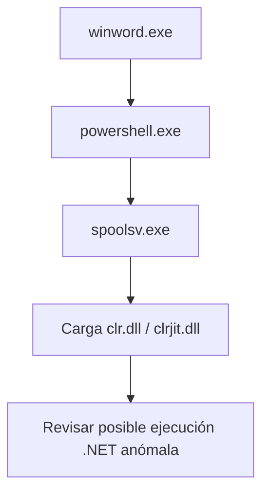

# Detección de .NET Runtime anómalo

## Idea clave

Procesos como `powershell.exe`, `pwsh.exe`, `msbuild.exe` o `w3wp.exe` pueden cargar componentes .NET de forma legítima.

Lo sospechoso es ver `clr.dll` o `clrjit.dll` cargados por procesos que normalmente no deberían ejecutar código .NET.

## Procesos investigables

Ejemplos que merecen revisión si cargan runtime .NET:

- `spoolsv.exe`
- `notepad.exe`
- `rundll32.exe`
- `regsvr32.exe`
- `winword.exe`
- `excel.exe`
- `wscript.exe`
- `cscript.exe`

> [!WARNING]
> No afirmar automáticamente que es malware. Validar siempre con contexto.

## Caso tipo

```text
spoolsv.exe empieza a cargar clr.dll o clrjit.dll
```

Esto puede indicar ejecución de código .NET dentro de un proceso que normalmente no debería comportarse así.

Puede estar relacionado con técnicas como:

- PowerShell injection.
- Execute-assembly.
- In-memory C# execution.
- Process injection.

## Cadena sospechosa

```text
winword.exe
└── powershell.exe
    └── spoolsv.exe cargando clr.dll
```



## Ejemplo defensivo en Sentinel

```kql
DeviceImageLoadEvents
| where FileName in~ ("clr.dll", "clrjit.dll")
| where InitiatingProcessFileName !in~ ("powershell.exe", "pwsh.exe", "msbuild.exe", "w3wp.exe")
| project Timestamp, DeviceName, InitiatingProcessFileName, FileName, FolderPath, InitiatingProcessCommandLine, AccountName
```

### Qué busca

La query busca procesos que han cargado DLLs del runtime .NET, excluyendo algunos procesos donde puede ser normal.

> [!NOTE]
> Esta query es conceptual. Ajustar exclusiones según baseline del entorno.

## Pivote posterior en Sentinel

```kql
DeviceProcessEvents
| where DeviceName == "HOST_AFECTADO"
| where Timestamp between (datetime(YYYY-MM-DD HH:MM:SS) .. datetime(YYYY-MM-DD HH:MM:SS))
| project Timestamp, FileName, ProcessCommandLine, InitiatingProcessFileName, AccountName
```

## Cómo verlo en Cortex XSIAM/XDR

En Cortex, revisar:

- Causality chain.
- Causality Group Owner.
- Proceso padre.
- Proceso hijo.
- Módulos/DLL cargadas, si el dataset lo permite.
- Command line.
- Usuario.
- Host.
- Eventos de red.
- Eventos de creación/modificación de archivos.
- MITRE mapping.
- Si la alerta fue bloqueada o solo detectada.

> [!TIP]
> En XSIAM, no centrarse solo en el evento aislado. Revisar la película completa usando la cadena de causalidad.

```text
TODO: validar dataset/campo exacto en XSIAM para eventos de carga de módulos/DLL.
```

## Cómo verlo en Trend Micro Vision One

En TMV1 se investigaría desde:

- Workbench.
- Observed Attack Techniques.
- Endpoint activity.
- Process tree.
- Root cause process.
- MITRE ATT&CK mapping.
- Object/module evidence.
- Response actions.

### Señales a buscar

- Suspicious process injection.
- PowerShell abuse.
- Suspicious script execution.
- Process loads suspicious module.
- Defense evasion.

## Cómo lo investigaría un SOC

1. Confirmar qué proceso cargó `clr.dll` o `clrjit.dll`.
2. Revisar si el proceso suele usar .NET.
3. Revisar proceso padre e hijos.
4. Revisar usuario, ruta, firma y command line.
5. Buscar red posterior.
6. Buscar archivos creados o modificados.
7. Revisar alertas relacionadas en EDR/SIEM.
8. Decidir si es actividad legítima, Benign TP o sospechosa.

## Campos a revisar

| Campo | Pregunta |
|---|---|
| `FileName` | ¿La DLL es `clr.dll` o `clrjit.dll`? |
| `InitiatingProcessFileName` | ¿Qué proceso cargó el módulo? |
| `InitiatingProcessCommandLine` | ¿Qué argumentos usó? |
| `DeviceName` | ¿Qué host está afectado? |
| `AccountName` | ¿Qué usuario aparece? |
| Proceso padre | ¿Hay Office, script engine o navegador antes? |
| Conexiones de red | ¿Hay comunicación externa después? |
| Firma/ruta | ¿El binario es confiable y está en ruta esperada? |

## Notas para CDSA

- El valor está en detectar comportamiento anómalo, no en memorizar un proceso.
- `clr.dll` en PowerShell puede ser normal.
- `clr.dll` en `spoolsv.exe` puede ser raro.
- Validar siempre baseline por entorno.

Relacionado: [[00-managed-vs-native-code]], [[03-equivalencias-tmv1-cortex-sentinel]], [[Cortex-XSIAM]], [[SIEM]].

