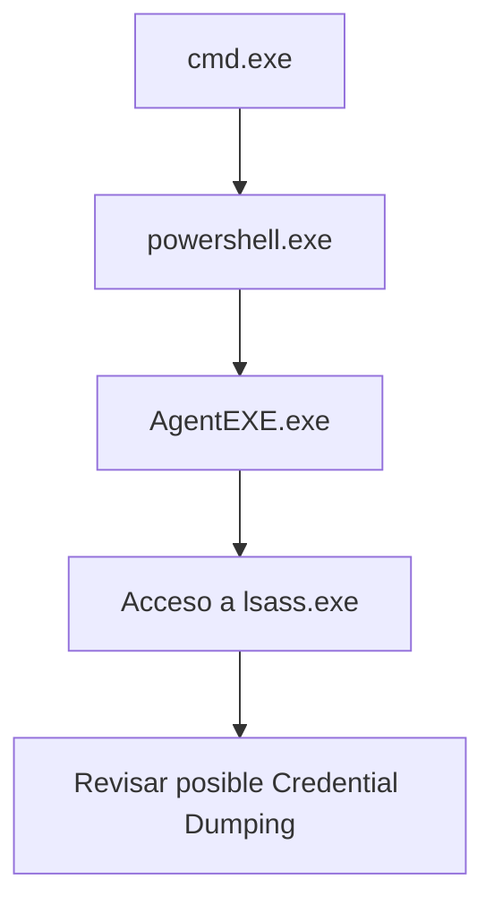

# Detección de Credential Dumping: acceso a LSASS

## Idea clave

LSASS, `lsass.exe`, gestiona credenciales y sesiones de autenticación en Windows.

Herramientas de credential dumping intentan acceder a la memoria de LSASS para extraer credenciales, hashes o tickets.

La detección no debe depender solo del nombre de una herramienta. Lo importante es el comportamiento:

```text
Proceso sospechoso accede a lsass.exe
```

> [!WARNING]
> Esta nota es defensiva. No incluye pasos ofensivos ni procedimientos de extracción.

## Por qué importa

El acceso anómalo a LSASS puede estar relacionado con:

- Credential Access.
- OS Credential Dumping.
- LSASS Memory.
- Robo de credenciales.
- Movimiento lateral posterior.

## Sysmon relevante

| Event ID | Evento | Uso |
|---|---|---|
| `10` | ProcessAccess | Detectar procesos que acceden a otros procesos, incluido LSASS |

## Campos importantes

| Campo | Qué revisar |
|---|---|
| `SourceImage` | Proceso que accede a LSASS |
| `TargetImage` | Debe apuntar a `lsass.exe` |
| `SourceUser` | Usuario del proceso origen |
| `TargetUser` | Usuario asociado al proceso objetivo si está disponible |
| `GrantedAccess` | Permisos solicitados sobre el proceso |
| `CallTrace` | Pila o módulos implicados |
| `ProcessId` | PID del proceso |
| `ProcessGuid` | Identificador estable de Sysmon |
| Ruta del binario origen | Si está en ruta esperada o sospechosa |
| Firma digital | Si el binario está firmado |
| Proceso padre | Qué lanzó el proceso origen |

## Procesos legítimos que pueden acceder a LSASS

Algunos procesos legítimos pueden tocar LSASS:

- EDR/AV.
- Procesos de autenticación.
- Herramientas administrativas legítimas.
- Componentes de seguridad.

Por eso hay que validar contexto.

## Ejemplo defensivo en Sentinel con Sysmon

```kql
Event
| where Source == "Microsoft-Windows-Sysmon"
| where EventID == 10
| where RenderedDescription has "lsass.exe"
```

Versión más estructurada si los campos están parseados:

```kql
Sysmon
| where EventID == 10
| where TargetImage endswith "\\lsass.exe"
| project TimeGenerated, Computer, SourceImage, TargetImage, SourceUser, GrantedAccess, CallTrace
```

## Búsqueda menos robusta por command line

```kql
DeviceProcessEvents
| where ProcessCommandLine has_any ("sekurlsa", "logonpasswords", "privilege::debug")
```

> [!WARNING]
> Esta última query es menos robusta porque depende de cadenas visibles en command line. Un atacante o herramienta puede cambiar nombres, argumentos o ejecución.

## Cómo verlo en Cortex XSIAM/XDR

Alertas comunes o conceptos relacionados:

- Credential Dumping.
- LSASS Memory Access.
- Suspicious access to LSASS.
- Mimikatz behavior.
- Hacktool.

Checklist:

- ¿Qué proceso accedió a LSASS?
- ¿Desde qué ruta se ejecutó?
- ¿Está firmado?
- ¿Quién lo lanzó?
- ¿Cuál es el parent process?
- ¿Se creó un dump?
- ¿Hubo conexiones externas?
- ¿Hay PowerShell/cmd antes?
- ¿Fue bloqueado?

```text
TODO: validar dataset/campo exacto en XSIAM para eventos de acceso a procesos y alertas Credential Access.
```

## Ejemplo de cadena

```text
cmd.exe
└── powershell.exe
    └── AgentEXE.exe
        └── access lsass.exe
```



## Rutas sospechosas

- `C:\Users\<user>\Downloads\`
- `C:\Users\Public\`
- `C:\Temp\`
- `C:\ProgramData\`

## Cómo verlo en Trend Micro Vision One

TMV1 puede mapearlo como:

- Credential Access.
- OS Credential Dumping.
- LSASS Memory.
- MITRE T1003.
- MITRE T1003.001.

Puntos a revisar:

- Detection name.
- MITRE tactic/technique.
- Process tree.
- Object involved.
- Endpoint.
- User.
- Response action.
- Related objects.
- Timeline.

## Cómo lo investigaría un SOC

1. Confirmar proceso origen y ruta.
2. Confirmar acceso a `lsass.exe`.
3. Revisar si el proceso pertenece a EDR/AV o herramienta legítima.
4. Revisar parent process.
5. Revisar usuario y privilegios.
6. Buscar creación de archivos dump.
7. Revisar conexiones externas posteriores.
8. Revisar actividad lateral o autenticaciones posteriores.

## Campos a revisar

| Campo | Pregunta |
|---|---|
| `SourceImage` | ¿Qué proceso accedió a LSASS? |
| `TargetImage` | ¿El objetivo es `lsass.exe`? |
| `GrantedAccess` | ¿Qué permisos pidió? |
| `CallTrace` | ¿Qué módulos aparecen? |
| Parent process | ¿Hay `cmd.exe`, PowerShell o script antes? |
| Ruta | ¿Está en Downloads, Temp, Public o ProgramData? |
| Firma | ¿Está firmado y es confiable? |
| Red posterior | ¿Hay comunicación externa? |

## Frase de conclusión tipo

```text
Se observa acceso anómalo al proceso LSASS por parte de un ejecutable no habitual.
Este comportamiento es compatible con técnicas de credential dumping, especialmente
OS Credential Dumping: LSASS Memory. Se recomienda revisar la cadena de procesos,
ruta del binario, usuario, privilegios, creación de dumps y actividad posterior.
```

## Notas para CDSA

- No dependas del nombre de la herramienta.
- Enfócate en comportamiento: proceso origen -> acceso a LSASS.
- Diferencia acceso legítimo de seguridad vs acceso desde ruta rara o proceso no habitual.
- Correlaciona con autenticaciones posteriores.

Relacionado: [[registros-eventos-windows-utiles]], [[03-equivalencias-tmv1-cortex-sentinel]], [[Cortex-XSIAM]], [[SIEM]].

