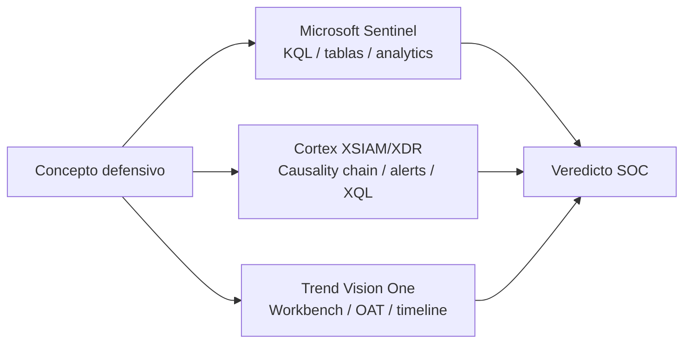

# Equivalencias: Trend Vision One, Cortex XSIAM/XDR y Microsoft Sentinel

## Idea clave

Cada herramienta usa nombres, vistas y datasets distintos, pero muchas investigaciones SOC responden a las mismas preguntas:

```text
¿Qué proceso hizo qué acción, desde qué ruta, con qué usuario, lanzado por quién y con qué actividad alrededor?
```

Regla mental:

```text
Proceso + Ruta + Usuario + Padre + Acción + Contexto = Veredicto
```

## Tabla de equivalencias

| Concepto | Sentinel | Cortex XSIAM/XDR | Trend Vision One |
|---|---|---|---|
| Proceso sospechoso | `DeviceProcessEvents` / `SecurityEvent` / Sysmon | Process events / causality chain | Workbench process tree |
| DLL cargada | `DeviceImageLoadEvents` / Sysmon 7 | Module/Image load events, si disponible | Object/module evidence |
| Acceso a LSASS | Sysmon 10 / MDE events | Credential access alerts | Observed Attack Technique |
| Timeline | KQL por host y tiempo | Alert timeline / CGO | Workbench timeline |
| MITRE | Entity mapping / analytics rules | Technique mapping | MITRE panel |
| Respuesta | Defender actions / Logic Apps | XDR response actions / playbooks | Response actions |

## Apoyo visual



## Microsoft Sentinel

En Sentinel o entornos Microsoft Defender, el analista suele pivotar con KQL sobre tablas como:

- `DeviceProcessEvents`
- `DeviceImageLoadEvents`
- `SecurityEvent`
- `Event`
- `Sysmon` si existe tabla parseada

> [!WARNING]
> Los nombres exactos dependen de conectores, licencias, Microsoft Defender, Sysmon y normalización.

## Cortex XSIAM/XDR

En Cortex, revisar:

- Alert timeline.
- Causality chain.
- Causality Group Owner.
- Process events.
- Command line.
- Eventos de red.
- Eventos de archivos.
- MITRE mapping.
- Estado: blocked, detected u observed.

```text
TODO: validar dataset/campo exacto en XSIAM según tenant.
```

## Trend Micro Vision One

En TMV1, revisar:

- Workbench.
- Observed Attack Techniques.
- Endpoint activity.
- Process tree.
- Root cause process.
- MITRE ATT&CK mapping.
- Object/module evidence.
- Response actions.

## Checklist TMV1

- ¿Cuál es el root cause process?
- ¿Qué proceso cargó el módulo?
- ¿Hay PowerShell/Office/navegador antes?
- ¿Hay conexión externa después?
- ¿Qué MITRE technique asigna Vision One?
- ¿La acción fue blocked, detected u observed?

## Cómo lo investigaría un SOC

1. Traducir la alerta a comportamiento.
2. Identificar entidad principal: host, usuario, proceso.
3. Reconstruir timeline.
4. Revisar parent/child process.
5. Revisar ruta, firma y command line.
6. Revisar red y archivos.
7. Comparar con baseline.
8. Decidir y documentar.

## Campos a revisar

| Campo lógico | Sentinel | Cortex | TMV1 |
|---|---|---|---|
| Host | `DeviceName`, `Computer` | Host / endpoint | Endpoint |
| Usuario | `AccountName`, `SourceUser` | User / actor | User |
| Proceso | `FileName`, `SourceImage` | Process name | Process |
| Padre | `InitiatingProcessFileName` | Parent / causality | Parent / root cause |
| Ruta | `FolderPath`, `SourceImage` | File path | Object path |
| Acción | Event/action/table | Alert/event action | Detection/activity |
| MITRE | Rule mapping | Technique mapping | MITRE panel |

## Notas para CDSA

- Aprende a traducir nombres de herramienta a conceptos comunes.
- No te cases con una tabla o dataset: valida campos reales.
- La investigación madura usa timeline, causalidad y contexto, no solo una query.

Relacionado: [[01-deteccion-dotnet-runtime-anomalo]], [[02-deteccion-credential-dumping-lsass]], [[Cortex-XSIAM]], [[SIEM]].

