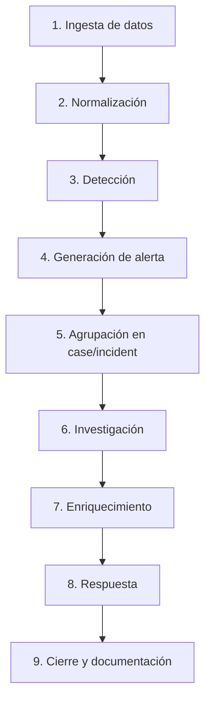

# Flujo operativo SOC

Flujo recomendado para entender cómo una señal se convierte en investigación y cierre.

## Pasos

| Paso | Qué ocurre | Qué hace el analista |
|---|---|---|
| Ingesta | Llegan logs y eventos. | Confirmar si la fuente existe y está actualizada. |
| Normalización | Se ordenan campos y entidades. | Identificar datasets y campos disponibles. |
| Detección | Se evalúan reglas o analíticas. | Revisar lógica, severidad y contexto. |
| Alerta | Se genera una señal accionable. | Priorizar y validar evidencias. |
| Case/Incident | Se agrupan alertas relacionadas. | Evitar analizar señales aisladas sin contexto. |
| Investigación | Se consulta XQL y entidades. | Buscar usuario, host, IP, proceso, hashes y timeline. |
| Enriquecimiento | Se añade reputación/contexto. | Ver IOC, asset crítico, usuario privilegiado o MITRE. |
| Respuesta | Se ejecutan acciones. | Escalar, aislar, bloquear, notificar o abrir ticket. |
| Cierre | Se documenta decisión. | Marcar TP/FP y dejar evidencia suficiente. |

> [!NOTE]
> Para un analista SOC: la calidad del cierre importa. Un cierre pobre hace que el siguiente analista pierda tiempo y que el SOC no aprenda.

Relacionado: [[checklist-analisis-alerta]], [[plantilla-analisis-alerta]], [[mapa-de-aprendizaje]].

