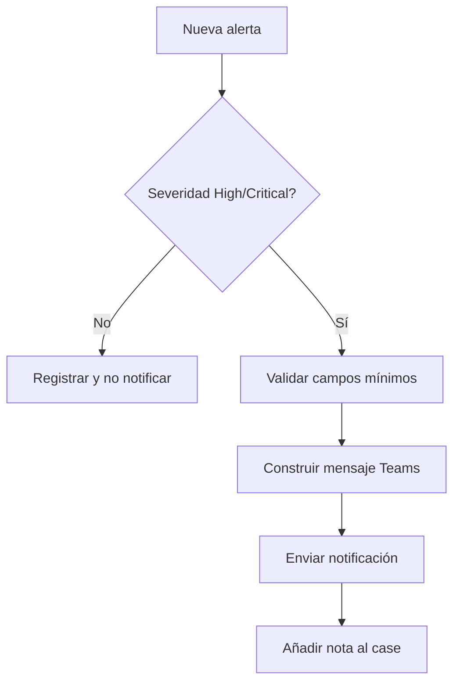
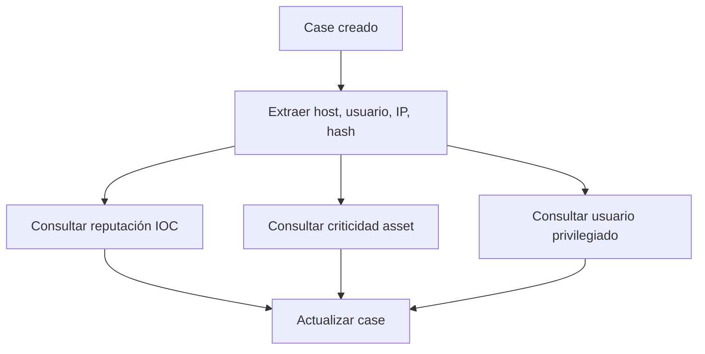

# Ejemplos de playbooks

## Notificación de alerta High/Critical

## Enriquecimiento básico

> [!NOTE]
> Estos flujos son diseños conceptuales. La implementación exacta depende de integraciones, permisos y versión.

Relacionado: [[estructura-basica-playbook]], [[buenas-practicas]], [[evolucion-a-playbooks]].

