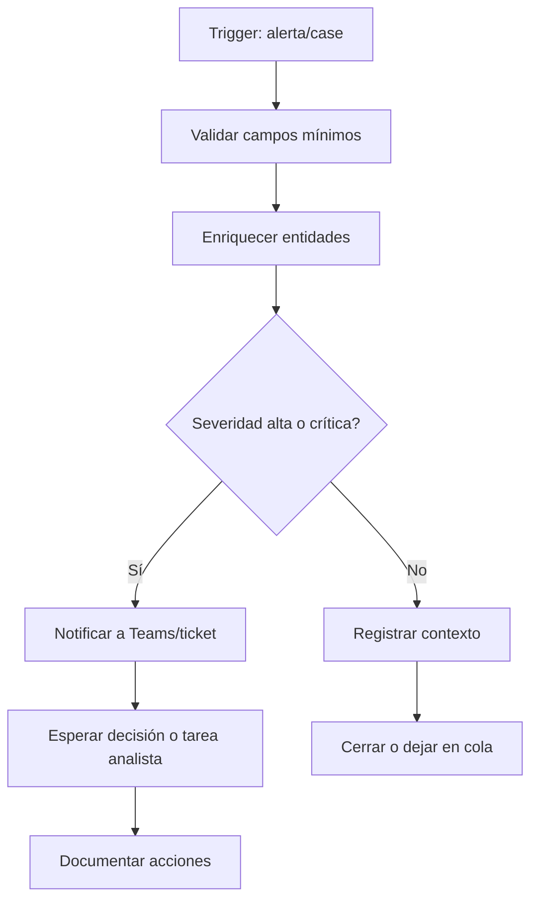

# Estructura básica de playbook

## Bloques habituales

| Bloque | Objetivo |
|---|---|
| Validación | Confirmar que existen campos mínimos. |
| Enriquecimiento | Añadir contexto de IOC, asset, usuario o reputación. |
| Decisión | Separar ramas por severidad, tipo de alerta o criticidad. |
| Notificación | Enviar mensaje a canal operativo. |
| Acción | Contener, bloquear, abrir ticket o escalar. |
| Cierre | Documentar resultado y clasificación. |

> [!TIP]
> Diseña primero el flujo manual. Automatiza después los pasos repetibles.

Relacionado: [[condiciones-y-branches]], [[notificaciones]], [[buenas-practicas]].

