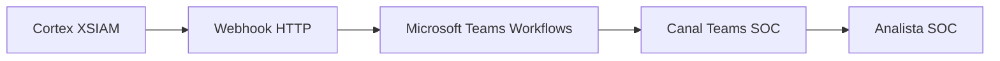

# Arquitectura simple

## Componentes

| Componente | Responsabilidad |
|---|---|
| Cortex XSIAM | Generar alerta y construir payload. |
| Webhook | Recibir datos desde XSIAM o flujo intermedio. |
| Teams Workflows | Procesar payload y publicar mensaje. |
| Canal Teams | Mostrar notificación al SOC. |

## Control mínimo

- URL de webhook almacenada como secreto.
- Filtro por severidad.
- Payload pequeño y validado.
- Canal de pruebas antes de producción.
- Registro de errores.

> [!TIP]
> Para el MVP, menos campos y mejor formato suele funcionar mejor que mensajes enormes.

Relacionado: [[webhooks]], [[formato-mensaje-teams]], [[riesgos-y-controles]].

