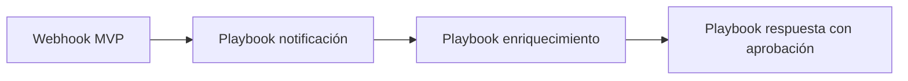

# Evolución a playbooks

El MVP con webhook valida utilidad. La evolución natural es usar playbooks para controlar mejor lógica, enriquecimiento, decisiones y trazabilidad.

## Fase 1: MVP webhook

- Filtrar alertas relevantes.
- Enviar mensaje básico a Teams.
- Medir ruido y utilidad.
- Ajustar campos.

## Fase 2: Playbook de notificación

- Validar campos mínimos.
- Enriquecer host, usuario, IP o hash.
- Formatear mensaje según severidad.
- Registrar resultado en el case.
- Controlar duplicados.

## Fase 3: Playbook de respuesta

- Abrir ticket si aplica.
- Pedir aprobación humana para contención.
- Ejecutar acciones solo si hay criterio claro.
- Documentar automáticamente evidencias y decisión.

> [!WARNING]
> No automatizar acciones de contención sin pruebas, aprobación y rollback operativo.

Relacionado: [[que-es-un-playbook]], [[buenas-practicas]], [[ejemplos-playbooks]].

