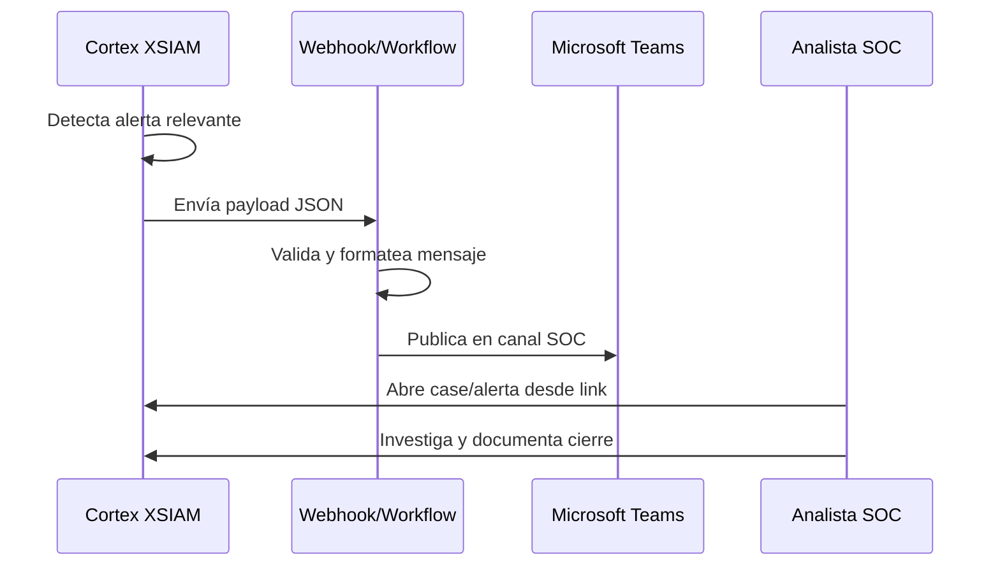

# Flujo XSIAM a Teams

## Pasos operativos

1. Se genera una alerta en XSIAM.
2. Se aplica filtro de severidad o criterio SOC.
3. Se envía payload al webhook.
4. Teams Workflows transforma o publica el mensaje.
5. El analista abre XSIAM desde el enlace.
6. La investigación y cierre se documentan en XSIAM.

Relacionado: [[propuesta-mvp]], [[formato-mensaje-teams]], [[problemas-con-webhooks]].

