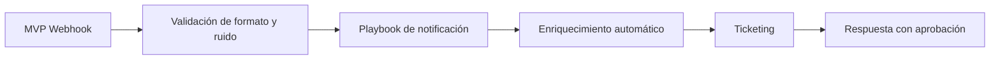

# Diagrama: evolución MVP a playbook

```mermaid
flowchart LR
  A["MVP Webhook"] --> B["Validación de formato y ruido"]
  B --> C["Playbook de notificación"]
  C --> D["Enriquecimiento automático"]
  D --> E["Ticketing"]
  E --> F["Respuesta con aprobación"]
```

