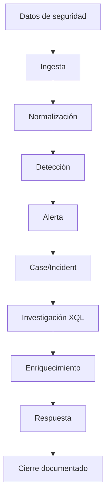

# Diagrama: flujo de alerta XSIAM

```mermaid
flowchart TD
  A["Datos de seguridad"] --> B["Ingesta"]
  B --> C["Normalización"]
  C --> D["Detección"]
  D --> E["Alerta"]
  E --> F["Case/Incident"]
  F --> G["Investigación XQL"]
  G --> H["Enriquecimiento"]
  H --> I["Respuesta"]
  I --> J["Cierre documentado"]
```

