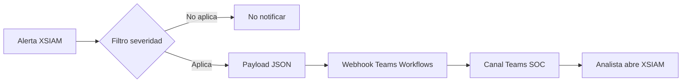

# Diagrama: flujo webhook Teams

```mermaid
flowchart LR
  A["Alerta XSIAM"] --> B{"Filtro severidad"}
  B -->|No aplica| C["No notificar"]
  B -->|Aplica| D["Payload JSON"]
  D --> E["Webhook Teams Workflows"]
  E --> F["Canal Teams SOC"]
  F --> G["Analista abre XSIAM"]
```

