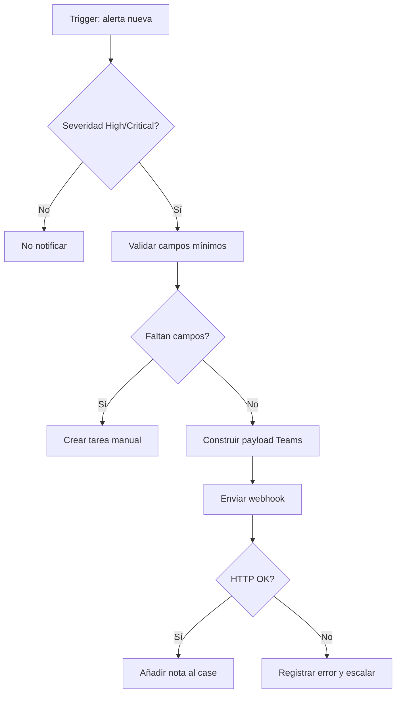

# Ejemplo de flujo de notificación

```mermaid
flowchart TD
  A["Trigger: alerta nueva"] --> B{"Severidad High/Critical?"}
  B -->|No| C["No notificar"]
  B -->|Sí| D["Validar campos mínimos"]
  D --> E{"Faltan campos?"}
  E -->|Sí| F["Crear tarea manual"]
  E -->|No| G["Construir payload Teams"]
  G --> H["Enviar webhook"]
  H --> I{"HTTP OK?"}
  I -->|Sí| J["Añadir nota al case"]
  I -->|No| K["Registrar error y escalar"]
```

## Campos mínimos

- Severidad
- Cliente
- Alerta
- Case/Issue ID
- Host
- Usuario
- Resumen
- Link a XSIAM

