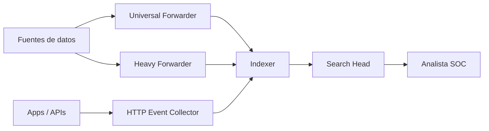

# Introducción a Splunk y SPL

## Idea clave

**Splunk** es una plataforma para ingerir, indexar, buscar, analizar y visualizar grandes volúmenes de datos de máquina.

En un SOC, Splunk se usa como SIEM para centralizar logs, investigar alertas, crear búsquedas, generar dashboards, detectar comportamientos sospechosos y apoyar respuesta a incidentes.

> [!NOTE]
> Para un analista SOC: Splunk es una herramienta para hacer preguntas a los logs. SPL es el idioma con el que formulas esas preguntas.

## Comparación rápida con herramientas que ya conoces

| Concepto | Splunk | Elastic/Kibana | Cortex XSIAM |
|---|---|---|---|
| Lenguaje | SPL | KQL / Lucene / ES Query DSL | XQL |
| Contenedor de datos | `index` | index / data stream / data view | dataset / preset |
| Tipo de fuente | `sourcetype` | `event.dataset`, `data_stream.dataset` | dataset + campos normalizados |
| Interfaz | Splunk Web / Search Head | [[Kibana]] | Consola XSIAM |
| Enriquecimiento | `lookup`, fields, knowledge objects | enrich, runtime fields, ingest pipelines | datasets, joins, enrichment, playbooks |
| Hunting | búsquedas SPL | Discover/KQL | XQL queries |
| Visualización | dashboards/reports | dashboards/Lens | dashboards e incident views |

Regla mental:

```text
Elastic/Kibana = buscar en índices con KQL.
Cortex XSIAM = investigar datasets con XQL.
Splunk = buscar en índices con SPL.
```

## Arquitectura básica de Splunk



| Componente | Qué hace | Comparación mental |
|---|---|---|
| Universal Forwarder | Agente ligero que envía logs | Elastic Agent / collector |
| Heavy Forwarder | Recoge, parsea y puede enrutar datos | Pipeline intermedio con más lógica |
| HTTP Event Collector | Recibe eventos por API/token | Ingesta por API |
| Indexer | Procesa, indexa y almacena eventos | Nodo de datos en Elastic |
| Search Head | Interfaz y coordinación de búsquedas | Kibana + capa de búsqueda |
| Deployment Server | Distribuye configuración a forwarders | Gestión central de agentes |
| License Manager | Controla licenciamiento | Gestión de consumo/licencia |

> [!WARNING]
> La arquitectura real depende de licencia, tamaño del entorno, clustering, volumen diario, retención y diseño de alta disponibilidad.

## Componentes clave

| Elemento | Explicación sencilla |
|---|---|
| Splunk Web | Interfaz gráfica para buscar, crear alertas, informes y dashboards |
| SPL | Lenguaje de consulta de Splunk |
| Apps | Soluciones o espacios de trabajo con contenido listo |
| Add-ons | Integraciones, parsers, extracciones y soporte para fuentes |
| Knowledge Objects | Campos, tags, event types, lookups, macros, data models y alertas |

> [!TIP]
> En Splunk, mucho valor vive en los Knowledge Objects. Ayudan a convertir logs crudos en datos más fáciles de buscar.

## SPL explicado sencillo

SPL funciona como una tubería:

```text
búsqueda inicial | comando 1 | comando 2 | comando 3
```

Ejemplo:

```spl
index="main" sourcetype="WinEventLog:Sysmon" EventCode=1
| table _time, host, Image, CommandLine, User
```

Lectura:

```text
Busca procesos creados en Sysmon y muéstrame hora, host, proceso, línea de comandos y usuario.
```

## Búsqueda básica

```spl
index="main" "UNKNOWN"
```

Busca eventos en el índice `main` que contengan la palabra `UNKNOWN`.

Con comodín:

```spl
index="main" "*UNKNOWN*"
```

> [!NOTE]
> El nombre del índice, `sourcetype` y campos como `Image` o `EventCode` dependen de cómo esté ingestada la fuente.

## Filtros por campo

```spl
index="main" EventCode!=1
```

Busca eventos cuyo `EventCode` no sea `1`.

Ejemplo Sysmon:

```spl
index="main" sourcetype="WinEventLog:Sysmon" EventCode=1
```

Lectura SOC:

```text
Quiero eventos Sysmon de creación de proceso.
```

## Comandos SPL básicos

| Comando | Para qué sirve | Equivalencia mental |
|---|---|---|
| `fields` | incluir/excluir campos | seleccionar columnas |
| `table` | mostrar resultados en tabla | vista tabular |
| `rename` | renombrar campos | alias temporal |
| `dedup` | eliminar duplicados | valores únicos |
| `sort` | ordenar resultados | ordenar por tiempo/campo |
| `stats` | agrupar y calcular | `group by` |
| `chart` | preparar datos para visualización | tabla pivote |
| `eval` | crear/modificar campos | campo calculado |
| `rex` | extraer campos con regex | parseo manual |
| `lookup` | enriquecer con tabla externa | enrich/join sencillo |
| `inputlookup` | leer una tabla lookup | ver lista externa |
| `transaction` | agrupar eventos relacionados | sesión/secuencia |

## Ejemplos prácticos

### Mostrar procesos creados

```spl
index="main" sourcetype="WinEventLog:Sysmon" EventCode=1
| table _time, host, Image, CommandLine, User
| sort - _time
```

Para un analista SOC:

```text
Útil para ver qué se ejecutó, por quién, en qué host y con qué argumentos.
```

### Buscar conexiones de red Sysmon

```spl
index="main" sourcetype="WinEventLog:Sysmon" EventCode=3
| table _time, host, Image, DestinationIp, DestinationPort
| sort - _time
```

Comparación:

- En [[Elastic]], buscarías campos tipo `process.name`, `destination.ip`, `destination.port`.
- En [[Cortex-XSIAM]], buscarías en datasets de endpoint/network con XQL.

### Contar conexiones por proceso

```spl
index="main" sourcetype="WinEventLog:Sysmon" EventCode=3
| stats count by Image
| sort - count
```

Lectura SOC:

```text
Qué procesos generan más eventos de red.
```

### Extraer nombre de fichero desde una ruta

```spl
index="main" sourcetype="WinEventLog:Sysmon" EventCode=1
| rex field=Image "(?P<filename>[^\\\]+)$"
| eval filename=lower(filename)
| table _time, host, filename, Image
```

Para qué sirve:

```text
Normaliza rutas completas para poder comparar nombres de binarios.
```

### Enriquecer con una lookup

Ejemplo de `malware_lookup.csv`:

```csv
filename,is_malware
notepad.exe,false
cmd.exe,false
powershell.exe,false
sharphound.exe,true
randomfile.exe,true
```

Consulta:

```spl
index="main" sourcetype="WinEventLog:Sysmon" EventCode=1
| rex field=Image "(?P<filename>[^\\\]+)$"
| eval filename=lower(filename)
| lookup malware_lookup.csv filename OUTPUTNEW is_malware
| table _time, host, filename, is_malware
| dedup filename, is_malware
```

Lectura:

```text
Extrae el ejecutable, lo normaliza y lo cruza con una tabla externa.
```

> [!WARNING]
> Un nombre de fichero marcado como malicioso no prueba compromiso. Validar ruta, hash, firma, usuario, comportamiento y contexto.

### Proceso creado y conexión posterior

```spl
index="main" sourcetype="WinEventLog:Sysmon" (EventCode=1 OR EventCode=3)
| transaction Image startswith=eval(EventCode=1) endswith=eval(EventCode=3) maxspan=1m
| table Image, host, duration, eventcount
| dedup Image
```

Lectura SOC:

```text
Busca ejecutables que aparecen como proceso creado y poco después generan conexión de red.
```

> [!WARNING]
> `transaction` puede ser costoso en búsquedas grandes. En producción, acota por tiempo, host, sourcetype o entidad inicial.

### Buscar procesos raros excluyendo los más comunes

```spl
index="main" sourcetype="WinEventLog:Sysmon" EventCode=1
NOT [
  search index="main" sourcetype="WinEventLog:Sysmon" EventCode=1
  | top limit=100 Image
  | fields Image
]
| table _time, host, Image, CommandLine, User
| sort - _time
```

Para qué sirve:

```text
Resalta procesos menos frecuentes, que pueden merecer investigación.
```

> [!WARNING]
> Raro no significa malicioso. Este enfoque genera ruido si el entorno cambia mucho o hay software nuevo.

## SPL vs KQL vs XQL

| Tarea | Splunk SPL | Elastic KQL | Cortex XSIAM XQL |
|---|---|---|---|
| Buscar procesos Sysmon | `index=main sourcetype=... EventCode=1` | `event.code: 1 and event.provider: Sysmon` | dataset endpoint/process según tenant |
| Mostrar columnas | `| table _time, host, Image` | Discover columns / Lens | `| fields ...` |
| Agrupar | `| stats count by Image` | Lens / aggregations / ES query | `| comp count() by ...` |
| Campo calculado | `| eval field=lower(Image)` | runtime field / ingest / query funcs | `alter` / funciones XQL según caso |
| Regex | `| rex field=...` | runtime/scripted/regexp | funciones de extracción según XQL |
| Enriquecimiento | `lookup` | enrich policy / lookup index | joins/datasets/enrichment |
| Secuencia | `transaction` | EQL / correlation rules | correlation/query/playbook según caso |

> [!NOTE]
> La sintaxis cambia, pero el pensamiento SOC es el mismo: fuente, tiempo, entidad, pivote, evidencia.

## Para CDSA

Aunque el entorno del examen puede variar, conocer SPL ayuda porque:

- refuerza pensamiento SIEM;
- enseña a transformar datos con tuberías;
- entrena búsquedas por tiempo, host, proceso y usuario;
- ayuda a entender comparativas con [[Elastic]] y [[Kibana]];
- aparece mencionado en experiencias comunitarias como conocimiento SIEM útil.

## Errores comunes

| Error | Cómo evitarlo |
|---|---|
| Buscar sin acotar tiempo | Usar selector temporal o `earliest/latest` |
| No validar campos disponibles | Revisar eventos crudos y field sidebar |
| Confundir `index` con `sourcetype` | `index` agrupa almacenamiento; `sourcetype` describe formato/fuente |
| Usar `transaction` sobre demasiado volumen | Filtrar antes |
| Tomar `lookup` como veredicto | Usarlo como enriquecimiento, no como prueba final |
| No guardar query | Documentar búsqueda y resultado |

## Regla mental

```text
Splunk indexa datos.
SPL hace preguntas.
El analista convierte resultados en evidencias.
```

```text
SPL no reemplaza criterio SOC: proceso + usuario + host + tiempo + red + contexto = decisión.
```

## Relacionado

- [[Splunk]]
- [[SIEM]]
- [[Elastic]]
- [[Kibana]]
- [[Cortex-XSIAM]]
- [[Windows]]
- [[conceptos-basicos-sysmon]]
- [[Zeek]]
- [[CDSA]]

