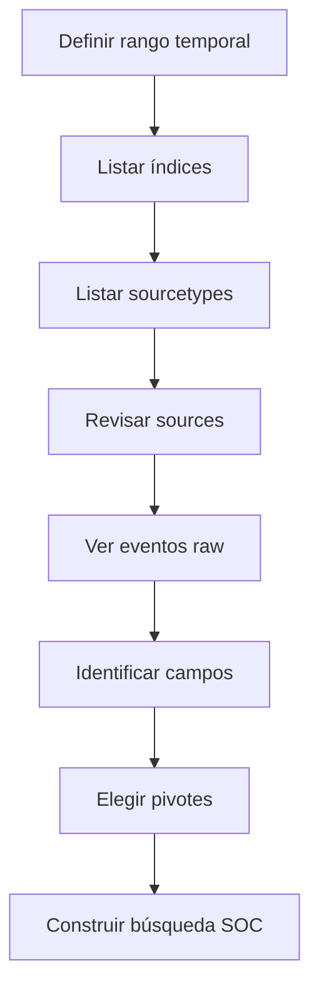

# Identificar datos y campos disponibles en Splunk

## Idea clave

Antes de investigar en Splunk, necesitas responder tres preguntas:

```text
¿Qué índices tengo?
¿Qué sourcetypes existen?
¿Qué campos puedo usar para pivotar?
```

Esto es igual que en [[Elastic]] cuando revisas índices/data views y campos en [[Kibana]], o como en [[Cortex-XSIAM]] cuando validas datasets, presets y campos antes de escribir XQL.

> [!NOTE]
> Para un analista SOC: no empieces una investigación escribiendo queries complejas. Primero entiende qué datos existen, en qué rango temporal y con qué campos.

## Comparación con herramientas conocidas

| Necesidad | Splunk | Elastic/Kibana | Cortex XSIAM |
|---|---|---|---|
| Ver contenedores de datos | `index` | index / data view | dataset |
| Ver tipo de dato | `sourcetype` | `event.dataset`, integración, data stream | dataset/preset |
| Ver origen concreto | `source` | `log.file.path`, `event.module`, source fields | collector/source fields |
| Ver host | `host` | `host.name` | endpoint/host fields |
| Ver campos disponibles | `fieldsummary`, sidebar de campos | Discover fields | esquema/dataset browser/XQL |
| Ver datos crudos | `_raw` | `_source`, JSON event | raw event/details |

## Enfoque 1 - Identificar datos con SPL

### Ver índices con eventos

```spl
| eventcount summarize=false index=*
| table index
```

Qué hace:

- cuenta eventos por índice;
- muestra qué índices tienen datos;
- ayuda a saber dónde empezar.

> [!TIP]
> Ajusta el rango temporal antes de ejecutar búsquedas exploratorias. Un índice puede existir, pero no tener eventos en la ventana seleccionada.

### Ver sourcetypes disponibles

```spl
| metadata type=sourcetypes index=*
| table sourcetype
```

Qué significa:

```text
sourcetype = tipo/formato de datos que Splunk asigna a eventos.
```

Ejemplos típicos:

```text
WinEventLog:Security
WinEventLog:Sysmon
linux_secure
stream:http
bro:conn:json
```

> [!NOTE]
> El nombre exacto del `sourcetype` depende de cómo se haya ingestada la fuente, add-ons instalados y normalización aplicada.

### Ver fuentes concretas

```spl
| metadata type=sources index=*
| table source
```

`source` suele indicar origen concreto del dato:

- ruta de fichero;
- canal de Windows Event Log;
- input;
- fuente técnica configurada.

### Ver eventos crudos

```spl
sourcetype="WinEventLog:Security"
| table _raw
```

`_raw` muestra el evento original que Splunk indexó.

Para SOC:

```text
Útil cuando no sabes todavía qué campos ha extraído Splunk o necesitas validar el contenido real del evento.
```

## Ver campos disponibles

### Vista rápida con todos los campos

```spl
sourcetype="WinEventLog:Security"
| table *
```

> [!WARNING]
> `table *` puede generar una tabla enorme y poco útil. Úsalo solo para exploración corta y con rango temporal acotado.

### Elegir campos concretos

```spl
sourcetype="WinEventLog:Security"
| fields Account_Name, EventCode
| table Account_Name, EventCode
```

Lectura:

```text
Muéstrame solo cuenta y EventCode de eventos de seguridad Windows.
```

### Resumen de campos

```spl
sourcetype="WinEventLog:Security"
| fieldsummary
```

`fieldsummary` ayuda a entender:

| Columna | Qué indica |
|---|---|
| `field` | nombre del campo |
| `count` | eventos que contienen el campo |
| `distinct_count` | valores distintos |
| `is_exact` | si el cálculo es exacto o estimado |
| `min` / `max` | valores mínimo y máximo |
| `mean` / `stdev` | estadísticas si aplica |
| `values` | muestras de valores |
| `modes` | valores comunes |

> [!TIP]
> `fieldsummary` es una buena forma de saber qué campos sirven para pivotar: usuario, host, proceso, IP, EventCode, etc.

## Ver distribución temporal

```spl
index=* sourcetype=*
| bucket _time span=1d
| stats count by _time, index, sourcetype
| sort - _time
```

Qué responde:

```text
¿Qué datos tengo por día, índice y sourcetype?
```

Esto ayuda a detectar:

- fuentes que dejaron de enviar logs;
- picos de ingestión;
- huecos temporales;
- errores de parsing o onboarding.

## Buscar datos raros

### Sourcetypes poco comunes

```spl
index=* sourcetype=*
| rare limit=10 index, sourcetype
```

Sirve para ver combinaciones poco frecuentes de índice y sourcetype.

### Parent processes raros

```spl
index="main"
| rare limit=20 useother=f ParentImage
```

Lectura SOC:

```text
Muéstrame padres de procesos poco comunes.
```

> [!WARNING]
> Poco común no significa malicioso. Sirve para generar hipótesis, no para cerrar una alerta.

### Campos poco frecuentes

```spl
index=* sourcetype=*
| fieldsummary
| where count < 100
| table field, count, distinct_count
```

Útil para encontrar campos que aparecen poco y pueden indicar:

- fuente nueva;
- parsing parcial;
- tipo de evento raro;
- dato enriquecido que no aparece siempre.

### Diversidad por índice, fuente y host

```spl
index=*
| sistats count by index, sourcetype, source, host
```

Esto da una fotografía de diversidad:

```text
qué índice + sourcetype + source + host está aportando eventos.
```

## Enfoque 2 - Identificar datos con la UI de Splunk

### Data Inputs

Ruta aproximada:

```text
Settings -> Data inputs
```

Sirve para revisar entradas de datos como:

- files and directories;
- HTTP Event Collector;
- forwarders;
- scripts;
- TCP/UDP;
- inputs de apps/add-ons.

> [!NOTE]
> La visibilidad depende de permisos. Un analista SOC puede no tener acceso a Settings o Data Inputs en entornos productivos.

### Search & Reporting

En la app **Search & Reporting** puedes:

- elegir rango temporal;
- buscar eventos;
- expandir eventos;
- ver `_raw`;
- revisar campos seleccionados e interesantes;
- usar modos Fast, Smart y Verbose.

| Modo | Uso |
|---|---|
| Fast | exploración rápida, menos detalle |
| Smart | equilibrio automático |
| Verbose | más campos y detalle, pero más pesado |

### Campos en la interfaz

En el lateral de Search & Reporting verás:

| Tipo de campo | Qué significa |
|---|---|
| Selected Fields | campos principales visibles por defecto |
| Interesting Fields | campos presentes en una parte relevante de eventos |
| All Fields | lista completa de campos detectados |

Para SOC:

```text
El panel de campos es tu mapa. Te dice con qué puedes pivotar sin adivinar nombres.
```

## Data Models y Pivots

Los **Data Models** organizan datos complejos en estructuras más entendibles.

Pueden incluir objetos como:

- Authentication;
- Web;
- Network Traffic;
- Endpoint;
- Change;
- Malware.

Los **Pivots** permiten crear informes y visualizaciones sin escribir SPL complejo.

> [!TIP]
> Si el entorno usa Splunk Enterprise Security, los data models pueden ser muy importantes para búsquedas normalizadas, dashboards y detecciones.

## Método operativo recomendado



## Checklist SOC

| Pregunta | Comando o vista |
|---|---|
| ¿Qué índices tienen datos? | `eventcount` |
| ¿Qué tipos de datos existen? | `metadata type=sourcetypes` |
| ¿Qué fuentes concretas hay? | `metadata type=sources` |
| ¿Cómo es el evento original? | `table _raw` |
| ¿Qué campos hay? | `fieldsummary` / sidebar |
| ¿Hay datos por fecha? | `bucket _time` + `stats` |
| ¿Qué es raro? | `rare` |
| ¿Hay modelos de datos útiles? | Settings -> Data Models |

## Relación con investigación SOC

Antes de buscar actividad maliciosa, necesitas saber:

- qué datos tienes;
- qué rango temporal cubren;
- qué campos existen;
- qué fuente es más fiable;
- qué campos permiten unir historias.

Ejemplo:

```text
Si quieres investigar PowerShell sospechoso, primero valida si tienes logs de Windows, Sysmon, PowerShell Operational o EDR. Luego identifica campos como host, user, process, command line, parent process y timestamp.
```

## Errores comunes

| Error | Consecuencia |
|---|---|
| Buscar con `index=*` sin rango temporal | consultas lentas y ruido |
| Asumir nombres de campo | queries que no devuelven nada |
| No revisar `_raw` | pérdida de contexto |
| Usar `table *` sobre mucho volumen | resultados inmanejables |
| Confundir `source` y `sourcetype` | pivotes incorrectos |
| No validar permisos | pensar que no hay datos cuando solo no puedes verlos |

## Regla mental

```text
Primero inventario de datos.
Después búsqueda.
Luego hunting.
Finalmente detección o reporte.
```

Relacionado: [[Splunk]], [[00-introduccion-splunk-y-spl]], [[SIEM]], [[Elastic]], [[Kibana]], [[Cortex-XSIAM]], [[CDSA]].

