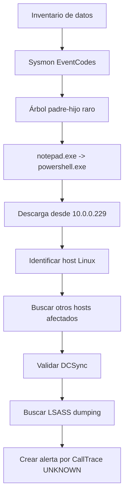
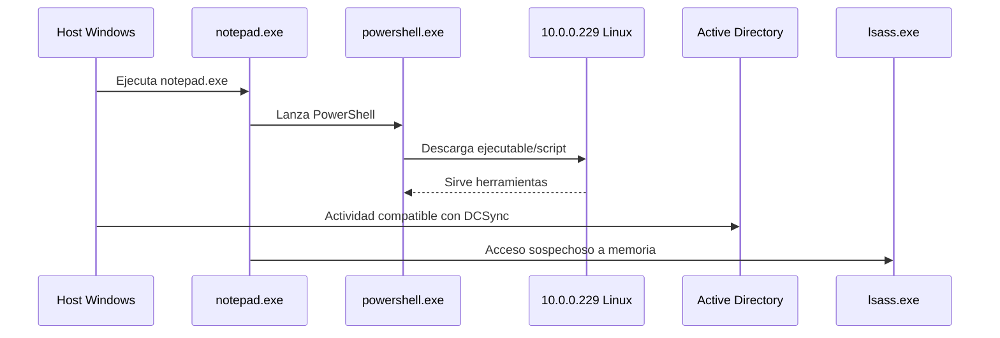

# Detección de intrusión con Splunk - escenario realista

## Idea clave

Este caso enseña cómo investigar una intrusión en Splunk partiendo de un dataset grande, como haría un analista SOC en un entorno real.

La diferencia frente a analizar un único `.evtx` es el volumen:

```text
Un host = investigación local.
Muchos hosts + muchos sourcetypes = hunting en SIEM.
```

> [!NOTE]
> Para un analista SOC: el objetivo no es mirar evento por evento, sino formular buenas preguntas, reducir ruido y pivotar entre fuentes.

## Flujo de investigación



## 1. Empezar por el inventario de datos

Antes de cazar amenazas, identifica qué datos tienes.

```spl
index="main" earliest=0
```

Después lista los `sourcetypes`:

```spl
index="main"
| stats count by sourcetype
```

Lectura:

```text
Qué fuentes hay disponibles: Security, Sysmon, syslog, etc.
```

Relacionado: [[01-identificar-datos-y-campos-en-splunk]].

## 2. Acotar a Sysmon

```spl
index="main" sourcetype="WinEventLog:Sysmon"
```

Sysmon es muy útil para hunting porque da visibilidad sobre:

- procesos;
- conexiones;
- acceso a procesos;
- módulos cargados;
- DNS;
- registry;
- pipes;
- cambios sospechosos.

## 3. Buscar de forma eficiente

No es lo mismo buscar texto libre que buscar por campo.

Menos eficiente:

```spl
index="main" *uniwaldo.local*
```

Más eficiente:

```spl
index="main" ComputerName="*uniwaldo.local"
```

> [!TIP]
> En Splunk, las búsquedas dirigidas a campos suelen ser más rápidas y reducen ruido. Esto importa mucho si la query después se convierte en alerta.

## 4. Ver EventCodes de Sysmon

```spl
index="main" sourcetype="WinEventLog:Sysmon"
| stats count by EventCode
```

Esto responde:

```text
¿Qué tipos de eventos Sysmon tengo realmente en este dataset?
```

EventCodes relevantes en este caso:

| EventCode | Uso SOC |
|---:|---|
| 1 | creación de proceso |
| 3 | conexión de red |
| 7 | DLL/image loaded |
| 10 | acceso a proceso, útil para LSASS |
| 11 | creación de fichero |
| 13 | cambio de valor de registro |
| 22 | DNS |

## 5. Detectar árbol padre-hijo raro

Primero mira relaciones padre-hijo:

```spl
index="main" sourcetype="WinEventLog:Sysmon" EventCode=1
| stats count by ParentImage, Image
```

Demasiado volumen. Acota a hijos sensibles:

```spl
index="main" sourcetype="WinEventLog:Sysmon" EventCode=1 (Image="*cmd.exe" OR Image="*powershell.exe")
| stats count by ParentImage, Image
```

Señal clave:

```text
notepad.exe -> powershell.exe
```

Por qué es raro:

```text
notepad.exe no suele lanzar PowerShell para descargar ejecutables.
```

Consulta enfocada:

```spl
index="main" sourcetype="WinEventLog:Sysmon" EventCode=1 (Image="*cmd.exe" OR Image="*powershell.exe") ParentImage="C:\\Windows\\System32\\notepad.exe"
```

Qué revisar:

- `ParentImage`;
- `ParentCommandLine`;
- `Image`;
- `CommandLine`;
- `User`;
- `host`;
- `_time`.

## 6. Pivotar por IP sospechosa

Si PowerShell descarga desde `10.0.0.229`, pivota por esa IP.

```spl
index="main" 10.0.0.229
| stats count by sourcetype
```

Si aparece `linux:syslog`, revisa:

```spl
index="main" 10.0.0.229 sourcetype="linux:syslog"
```

Lectura:

```text
La IP 10.0.0.229 pertenece a un host Linux que podría estar sirviendo herramientas o payloads.
```

> [!WARNING]
> Una IP interna no es maliciosa por sí misma. Se vuelve sospechosa por el contexto: PowerShell descargando ejecutables desde ella.

## 7. Buscar comandos relacionados con la IP

```spl
index="main" 10.0.0.229 sourcetype="WinEventLog:Sysmon"
| stats count by CommandLine
```

Después añade host:

```spl
index="main" 10.0.0.229 sourcetype="WinEventLog:Sysmon"
| stats count by CommandLine, host
```

Esto ayuda a responder:

- qué hosts descargaron desde esa IP;
- qué comandos usaron;
- qué herramientas se bajaron;
- si hubo movimiento lateral;
- si hay nombres de scripts o binarios claramente sospechosos.

## 8. Validar posible DCSync

Si aparece una herramienta/script de DCSync, no basta con asumir. Hay que validarlo con eventos de Active Directory.

Evento relevante:

```text
Windows Security Event ID 4662 = Object Operation / AD object access
```

Consulta:

```spl
index="main" EventCode=4662 Access_Mask=0x100 Account_Name!=*$
```

Por qué:

- `4662` registra acceso a objetos de AD si la auditoría está habilitada.
- `Access_Mask=0x100` indica Control Access.
- `Account_Name!=*$` excluye cuentas máquina.

GUIDs importantes:

| GUID | Significado |
|---|---|
| `1131f6ad-9c07-11d1-f79f-00c04fc2dcd2` | DS-Replication-Get-Changes-All |
| `19195a5b-6da0-11d0-afd3-00c04fd930c9` | permiso extendido relacionado con replicación |

Lectura SOC:

```text
Un usuario normal realizando acciones de replicación AD puede indicar DCSync.
```

Impacto:

```text
Si DCSync tuvo éxito, asumir compromiso severo del dominio. Considerar rotación de credenciales críticas y krbtgt según procedimiento.
```

> [!WARNING]
> No todos los 4662 son DCSync. La confirmación viene de combinar Access_Mask, Properties/GUIDs, cuenta, DC, contexto y timeline.

## 9. Buscar acceso sospechoso a LSASS

Sysmon EventCode 10:

```text
ProcessAccess
```

Consulta inicial:

```spl
index="main" EventCode=10 lsass
| stats count by SourceImage
```

Si aparece algo raro como `notepad.exe`:

```spl
index="main" EventCode=10 lsass SourceImage="C:\\Windows\\System32\\notepad.exe"
```

Campos clave:

- `SourceImage`;
- `TargetImage`;
- `GrantedAccess`;
- `CallTrace`;
- `SourceUser`;
- `TargetUser`;
- `host`.

Señal fuerte:

```text
notepad.exe accediendo a lsass.exe con GrantedAccess alto.
```

Por qué importa:

```text
Puede indicar credential dumping o proceso inyectado usado para abrir LSASS.
```

## 10. CallTrace con UNKNOWN

En el escenario, el `CallTrace` muestra regiones `UNKNOWN`.

Idea defensiva:

```text
Llamadas API desde regiones UNKNOWN pueden indicar shellcode o memoria no respaldada por archivo en disco.
```

Consulta base:

```spl
index="main" CallTrace="*UNKNOWN*"
| stats count by EventCode
```

Resultado esperado del caso:

```text
Los eventos interesantes caen en EventCode 10.
```

Agrupa por proceso origen:

```spl
index="main" CallTrace="*UNKNOWN*"
| stats count by SourceImage
```

## 11. Pasar de hunting a alerta

Una query de hunting puede tener ruido. Para alerta hay que reducir falsos positivos.

Primero elimina auto-accesos:

```spl
index="main" CallTrace="*UNKNOWN*"
| where SourceImage!=TargetImage
| stats count by SourceImage
```

Excluye ruido típico de JIT/.NET:

```spl
index="main" CallTrace="*UNKNOWN*" SourceImage!="*Microsoft.NET*" CallTrace!=*ni.dll* CallTrace!=*clr.dll*
| where SourceImage!=TargetImage
| stats count by SourceImage
```

Excluye WOW64:

```spl
index="main" CallTrace="*UNKNOWN*" SourceImage!="*Microsoft.NET*" CallTrace!=*ni.dll* CallTrace!=*clr.dll* CallTrace!=*wow64*
| where SourceImage!=TargetImage
| stats count by SourceImage
```

Excluye Explorer si en el entorno genera demasiado ruido:

```spl
index="main" CallTrace="*UNKNOWN*" SourceImage!="*Microsoft.NET*" CallTrace!=*ni.dll* CallTrace!=*clr.dll* CallTrace!=*wow64* SourceImage!="C:\\Windows\\Explorer.EXE"
| where SourceImage!=TargetImage
| stats count by SourceImage, TargetImage, CallTrace
```

> [!WARNING]
> Las exclusiones deben justificarse por entorno. No copies allowlists de un lab directamente a producción.

## Señales principales del escenario

| Señal | Interpretación |
|---|---|
| `notepad.exe -> powershell.exe` | árbol padre-hijo anómalo |
| PowerShell descargando `file.exe` | posible descarga de payload |
| IP interna `10.0.0.229` sirviendo herramientas | posible host pivote o comprometido |
| múltiples hosts descargando desde esa IP | expansión/movimiento lateral |
| EventCode 4662 + replication GUIDs | indicio fuerte de DCSync |
| EventCode 10 contra LSASS | posible credential dumping |
| `CallTrace=*UNKNOWN*` | posible shellcode/memoria no respaldada |

## Mini timeline del caso



## Hunting vs alerta

| Hunting | Alerta |
|---|---|
| Explora hipótesis | Debe ser estable |
| Tolera más ruido | Debe minimizar falsos positivos |
| Sirve para aprender el entorno | Sirve para operación continua |
| Puede ser manual | Debe tener prioridad, severidad y respuesta |
| Cambia con la investigación | Debe revisarse y tunearse |

## Cómo lo explicaría en un reporte

```text
Se identificó una cadena de ejecución anómala donde notepad.exe lanzó powershell.exe para descargar un ejecutable desde 10.0.0.229. La IP corresponde a un host Linux interno que aparece relacionado con múltiples descargas desde hosts Windows. Posteriormente se observaron evidencias compatibles con DCSync mediante EventCode 4662 y GUIDs de replicación de AD, así como acceso sospechoso a lsass.exe mediante Sysmon EventCode 10. La combinación de estas evidencias indica compromiso severo y posible robo de credenciales de dominio.
```

## Lecciones SOC

- Empieza por inventariar datos.
- Acota sourcetype y campos.
- Busca relaciones padre-hijo raras.
- Pivota por IP, host, usuario y command line.
- No asumas DCSync: valida con eventos y GUIDs.
- LSASS + proceso raro + acceso alto = investigar fuerte.
- `UNKNOWN` en `CallTrace` puede ser señal de memoria sospechosa.
- Una alerta no es una query de hunting pegada tal cual.

## Relacionado

- [[Splunk]]
- [[01-identificar-datos-y-campos-en-splunk]]
- [[00-introduccion-splunk-y-spl]]
- [[conceptos-basicos-sysmon]]
- [[05-comparativa-get-winevent-etw-sysmon]]
- [[02-deteccion-credential-dumping-lsass]]
- [[CDSA]]

