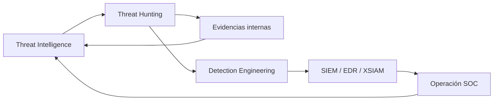
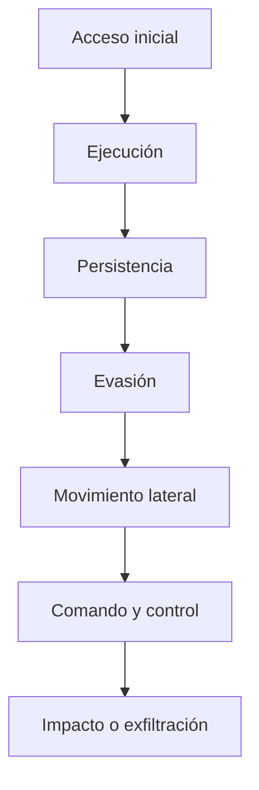

# Fundamentos de Cyber Threat Intelligence

## Idea clave

**Cyber Threat Intelligence (CTI)** es el proceso de convertir datos sobre amenazas en información útil para defender mejor una organización.

No se trata solo de recopilar IOCs, leer informes o guardar listas de IPs. La inteligencia tiene valor cuando ayuda al SOC, a threat hunting, a detection engineering o a dirección a tomar mejores decisiones.

> [!NOTE]
> Para un analista SOC: CTI sirve para entender qué amenazas importan, cómo operan y qué evidencias puedes buscar en tus herramientas.

> [!NOTE]
> Para usuario no técnico: CTI es como recibir avisos fiables sobre riesgos reales antes de que se conviertan en un incidente.

## Objetivo de CTI

El objetivo principal es pasar de una defensa puramente reactiva a una defensa más anticipada.

CTI ayuda a:

- entender campañas y adversarios que podrían afectar a la organización;
- enriquecer alertas, casos e investigaciones;
- identificar TTPs del adversario;
- priorizar controles defensivos;
- alimentar hunting, detecciones y respuesta a incidentes;
- dar contexto útil a responsables técnicos y de negocio.

## Los cuatro criterios de una buena inteligencia

Una inteligencia útil debe ser:

| Criterio | Qué significa | Pregunta SOC |
|---|---|---|
| Relevante | Aplica a nuestra organización, sector, tecnología o partners | ¿Esto afecta a algo que usamos o protegemos? |
| Oportuna | Llega a tiempo para tomar acción | ¿Sigue vivo este IOC o esta campaña? |
| Accionable | Permite hacer algo concreto | ¿Qué puedo buscar, bloquear, monitorizar o documentar? |
| Precisa | Está validada o indica nivel de confianza | ¿La fuente es fiable? ¿Puede generar falsos positivos? |

> [!WARNING]
> Un IOC antiguo, sin contexto o sin validación puede generar ruido. Antes de bloquear o alertar, valida impacto, fuente, antigüedad y relevancia.

## CTI vs Threat Hunting

| Disciplina | Enfoque | Pregunta principal | Resultado esperado |
|---|---|---|---|
| Threat Intelligence | Predictivo y contextual | ¿Quién podría atacarnos, cómo y por qué? | Contexto, perfiles, IOCs, TTPs, prioridades |
| Threat Hunting | Proactivo y/o reactivo | ¿Hay señales de esto en mi entorno? | Evidencias, hipótesis confirmadas, detecciones nuevas |

CTI y threat hunting se alimentan entre sí:

- CTI entrega IOCs, TTPs y contexto para iniciar hunts.
- Threat hunting devuelve evidencias internas que refinan la inteligencia.
- Detection Engineering convierte hallazgos repetibles en reglas o casos de uso.



## Tipos de inteligencia

### Inteligencia estratégica

Está orientada a dirección, responsables de seguridad y toma de decisiones.

Busca responder:

- ¿quién amenaza a la organización?
- ¿por qué nos podría atacar?
- ¿qué riesgo representa para el negocio?
- ¿qué tendencias o campañas afectan al sector?

Ejemplo:

```text
Un informe sobre un grupo APT que históricamente ataca gobiernos, defensa o proveedores estratégicos.
```

### Inteligencia operacional

Está orientada a mandos intermedios, equipos de seguridad y planificación defensiva.

Busca responder:

- ¿cómo opera una campaña?
- ¿dónde suele atacar?
- ¿qué fases sigue?
- ¿qué TTPs utiliza?

Ejemplo:

```text
Análisis de una campaña de ransomware: acceso inicial, movimiento lateral, abuso de credenciales y despliegue final.
```

### Inteligencia táctica

Está orientada a analistas SOC, hunters e incident responders.

Incluye detalles técnicos accionables:

- IPs;
- dominios;
- URLs;
- hashes;
- rutas de fichero;
- claves de registro;
- mutexes;
- user agents;
- patrones DNS o HTTP;
- técnicas MITRE ATT&CK.

Ejemplo:

```text
Lista de IOCs asociados a una campaña activa y consultas para buscarlos en SIEM o EDR.
```

## Cómo leer un reporte táctico de CTI

### 1. Entender el alcance

Antes de copiar IOCs, entiende la historia:

- ¿qué amenaza describe?
- ¿a qué sector apunta?
- ¿qué objetivo parece tener?
- ¿la campaña sigue activa?
- ¿afecta a tecnologías que usamos?

> [!TIP]
> Si el reporte no es relevante para tu entorno, quizá no necesitas una alerta nueva. Puede bastar con documentarlo o usarlo como contexto.

### 2. Clasificar IOCs

Agrupa los indicadores para decidir qué hacer con ellos.

| Tipo | Ejemplos | Dónde buscar |
|---|---|---|
| Red | IPs, dominios, URLs, certificados | Proxy, DNS, firewall, EDR, XSIAM |
| Host | hashes, rutas, nombres de archivo, mutexes | EDR, Sysmon, inventario, SIEM |
| Email | remitentes, asuntos, adjuntos, URLs | gateway, M365, logs de correo |
| Comportamiento | comandos, TTPs, secuencias de acciones | SIEM, EDR, hunting, timeline |

### 3. Entender el ciclo del ataque

Mapea el reporte a fases de ataque.



Ejemplo de lectura:

| Fase | Qué buscar |
|---|---|
| Acceso inicial | phishing, explotación, credenciales válidas |
| Ejecución | PowerShell, scripts, binarios sospechosos |
| Persistencia | tareas programadas, servicios, claves Run |
| Evasión | ofuscación, borrado de logs, LOLBins |
| Movimiento lateral | PsExec, WinRM, SMB, RDP |
| C2 | DNS raro, conexiones externas, user agents |

### 4. Validar los IOCs

No todos los IOCs tienen la misma calidad.

Antes de usarlos:

- revisa antigüedad;
- valida fuente;
- busca reputación en más de una fuente;
- comprueba si hay servicios legítimos compartiendo infraestructura;
- identifica posibles falsos positivos;
- etiqueta nivel de confianza si hay duda.

> [!WARNING]
> Una IP puede alojar servicios legítimos, sobre todo en cloud o hosting compartido. Bloquear sin contexto puede afectar al negocio.

### 5. Integrar en herramientas defensivas

Una vez validados, los IOCs pueden usarse para:

- crear búsquedas en SIEM;
- enriquecer alertas;
- alimentar listas de vigilancia;
- generar detecciones;
- actualizar EDR, proxy, firewall o email gateway;
- abrir una investigación de hunting.

> [!WARNING]
> Cualquier acción de bloqueo debe seguir el proceso de cambio y validación de impacto. En primera fase, muchas veces es mejor alertar que bloquear.

### 6. Hacer threat hunting

No te limites a buscar IOCs exactos. Busca también comportamientos.

Ejemplo:

```text
Si el reporte habla de malware que usa PowerShell ofuscado, busca también patrones de PowerShell sospechoso aunque no coincidan con los hashes del reporte.
```

Conecta esta fase con [[Detection-Engineering]], [[SIEM]], [[Cortex-XSIAM]] y [[get-winevent]].

### 7. Monitorizar y aprender

Después de integrar la inteligencia:

- monitoriza coincidencias;
- documenta falsos positivos;
- ajusta reglas;
- alimenta casos de uso;
- comparte hallazgos internos relevantes;
- actualiza la inteligencia si la campaña cambia.

## Checklist rápido para SOC

| Pregunta | Decisión |
|---|---|
| ¿Es relevante para mi organización? | Si no lo es, documentar y vigilar |
| ¿La campaña sigue activa? | Si no, usar como contexto histórico |
| ¿Los IOCs están validados? | Si no, enriquecer antes de alertar o bloquear |
| ¿Hay TTPs útiles? | Convertir en hipótesis de hunting |
| ¿Puede romper negocio? | Alertar antes de bloquear |
| ¿Hay evidencia interna? | Abrir caso o investigación |

## Regla mental

```text
Datos + Contexto + Validación + Acción = Inteligencia útil
```

```text
IOC sin contexto = pista, no veredicto
```

## Relacionado

- [[Blue-Team]]
- [[Detection-Engineering]]
- [[SIEM]]
- [[Cortex-XSIAM]]
- [[get-winevent]]
- [[conceptos-basicos-sysmon]]
- [[registros-eventos-windows-utiles]]

