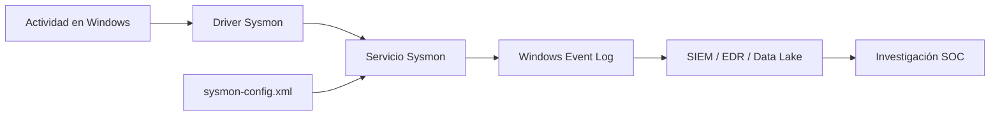
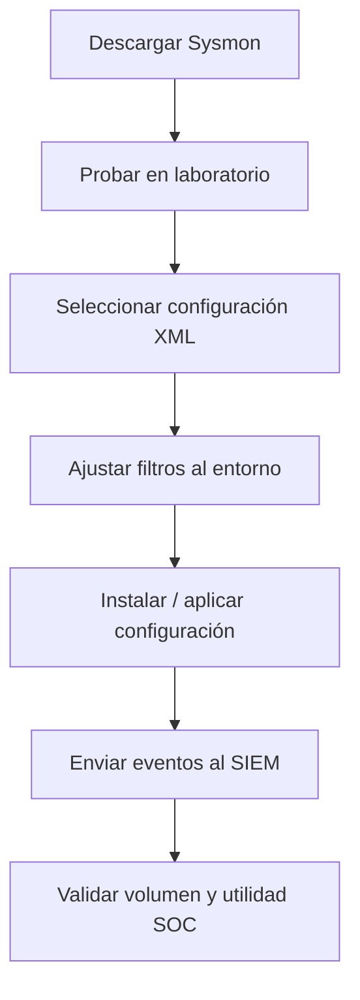

# Conceptos básicos de Sysmon

## Idea clave

Sysmon amplía la visibilidad de Windows registrando actividad que normalmente no aparece con tanto detalle en los logs de seguridad nativos.

Windows ya ofrece eventos muy útiles, como:

- `4624`: inicio de sesión correcto.
- `4625`: fallo de inicio de sesión.
- `4688`: creación de proceso, si la auditoría está habilitada.

Sysmon complementa esa visibilidad con eventos más ricos sobre procesos, conexiones de red, carga de imágenes, acceso a procesos, cambios en ficheros y otros comportamientos útiles para detección y análisis forense.

> [!NOTE]
> Para un analista SOC: Sysmon no sustituye a los logs de Windows. Los enriquece. La potencia aparece al correlacionar ambos.

## Qué es Sysmon

Sysmon, System Monitor, es una herramienta de Microsoft Sysinternals compuesta por un servicio del sistema y un controlador de dispositivo.

Permanece residente a través de reinicios y registra actividad del sistema en el registro de eventos de Windows.

Puede aportar información sobre:

- Creación de procesos.
- Conexiones de red.
- Cambios en tiempos de creación de archivos.
- Carga de DLLs/imágenes.
- Acceso a procesos.
- Creación de archivos.
- Consultas DNS, si está configurado.

> [!WARNING]
> La visibilidad real depende de la versión de Sysmon, la configuración XML aplicada, la política de auditoría, el SIEM y el forwarding de eventos.

## Componentes principales

| Componente | Función |
|---|---|
| Servicio de Windows | Monitoriza actividad del sistema y gestiona Sysmon |
| Controlador de dispositivo | Ayuda a capturar actividad del sistema a bajo nivel |
| Registro de eventos | Muestra los eventos capturados por Sysmon |
| Configuración XML | Define qué incluir, excluir y registrar |

## Apoyo visual



## Por qué Sysmon es útil en SOC

Sysmon registra información que puede no estar disponible en los eventos de seguridad nativos o que puede estar menos detallada.

Ejemplos:

| Necesidad SOC | Cómo ayuda Sysmon |
|---|---|
| Ver procesos creados | Event ID `1` |
| Ver conexiones de red por proceso | Event ID `3` |
| Revisar DLLs cargadas | Event ID `7`, si está habilitado |
| Detectar acceso a LSASS | Event ID `10`, ProcessAccess |
| Revisar archivos creados | Event ID `11` |
| Revisar consultas DNS | Event ID `22`, si está disponible/configurado |

> [!TIP]
> Sysmon gana mucho valor cuando se usa con una buena configuración. Sin filtrado, puede generar demasiado volumen.

## Event IDs básicos de Sysmon

| Event ID | Nombre habitual | Uso SOC |
|---|---|---|
| `1` | Process Create | Ver procesos nuevos, command line, parent process y usuario |
| `3` | Network Connection | Relacionar procesos con conexiones de red |
| `7` | Image Loaded | Detectar carga de DLLs o módulos sospechosos |
| `10` | Process Access | Investigar acceso a procesos sensibles como `lsass.exe` |
| `11` | File Create | Ver creación de archivos relevantes |
| `12/13/14` | Registry events | Revisar creación, modificación o renombrado de claves/valores |
| `15` | FileCreateStreamHash | Detectar alternate data streams |
| `22` | DNS Query | Ver dominios consultados por procesos |

> [!NOTE]
> Esta tabla es práctica, no exhaustiva. TODO: validar lista completa y nombres exactos con documentación oficial de Sysmon.

## Ejemplo: creación de proceso

Sysmon Event ID `1` ayuda a responder:

- ¿Qué proceso se ejecutó?
- ¿Qué command line tenía?
- ¿Qué proceso padre lo lanzó?
- ¿Qué usuario lo ejecutó?
- ¿Desde qué ruta?
- ¿Tiene hash?

Esto es clave para investigar abuso de PowerShell, LoLBins, scripts, binarios en rutas sospechosas o ejecución desde directorios temporales.

## Ejemplo: conexión de red

Sysmon Event ID `3` ayuda a responder:

- ¿Qué proceso generó la conexión?
- ¿Cuál fue la IP destino?
- ¿Qué puerto se usó?
- ¿Qué usuario estaba asociado?
- ¿La conexión es interna o externa?

Esto permite relacionar comportamiento de proceso con tráfico de red.

## Ejemplo: acceso a LSASS

Sysmon Event ID `10`, ProcessAccess, puede ayudar a detectar procesos que acceden a `lsass.exe`.

Esto es relevante para investigaciones de credential dumping.

Relacionado: [[02-deteccion-credential-dumping-lsass]].

## Configuración XML

Sysmon utiliza un archivo de configuración basado en XML.

Ese archivo permite:

- Incluir eventos concretos.
- Excluir ruido conocido.
- Filtrar por nombres de procesos.
- Filtrar por rutas.
- Filtrar por IPs.
- Ajustar qué se registra según el objetivo defensivo.

Ejemplos populares:

- SwiftOnSecurity Sysmon config: `https://github.com/SwiftOnSecurity/sysmon-config`
- Sysmon Modular de Olaf Hartong: `https://github.com/olafhartong/sysmon-modular`

> [!WARNING]
> No aplicar una configuración a producción sin probarla. Una configuración agresiva puede generar mucho volumen o afectar el coste de ingesta en SIEM.

## Instalación básica

Descarga oficial:

```text
https://docs.microsoft.com/en-us/sysinternals/downloads/sysmon
```

Instalación básica desde una consola con privilegios de administrador:

```cmd
C:\Tools\Sysmon> sysmon.exe -i -accepteula -h md5,sha256,imphash -l -n
```

Qué significa a alto nivel:

| Opción | Idea |
|---|---|
| `-i` | Instala Sysmon |
| `-accepteula` | Acepta la licencia |
| `-h md5,sha256,imphash` | Habilita hashes indicados |
| `-l` | Registra carga de imágenes, según versión/configuración |
| `-n` | Registra conexiones de red |

> [!NOTE]
> Validar opciones exactas con la ayuda de la versión instalada: `sysmon.exe -?`.

## Aplicar configuración personalizada

Después de instalar Sysmon, se puede aplicar una configuración XML:

```cmd
C:\Tools\Sysmon> sysmon.exe -c filename.xml
```

Flujo recomendado:



## Cómo lo investigaría un SOC

Cuando aparece un evento de Sysmon:

1. Identificar Event ID.
2. Identificar host.
3. Identificar usuario.
4. Revisar proceso y proceso padre.
5. Revisar command line.
6. Revisar ruta y firma del binario.
7. Revisar hash.
8. Correlacionar con eventos Windows nativos.
9. Correlacionar con EDR, proxy, DNS, firewall o SIEM.
10. Documentar TP, FP o Benign TP.

## Campos a revisar

| Campo | Pregunta SOC |
|---|---|
| `Image` | ¿Qué proceso ejecutó la acción? |
| `CommandLine` | ¿Qué argumentos usó? |
| `ParentImage` | ¿Qué proceso lo lanzó? |
| `User` | ¿Qué cuenta está asociada? |
| `Hashes` | ¿Qué hash tiene el binario? |
| `DestinationIp` | ¿A qué IP conectó? |
| `DestinationPort` | ¿Qué puerto destino usó? |
| `TargetImage` | ¿Qué proceso fue accedido? |
| `GrantedAccess` | ¿Qué permisos se solicitaron? |

## Relación con SIEM

Sysmon suele enviarse a una plataforma centralizada para búsqueda y correlación.

Puede alimentar:

- [[Elastic]]
- [[Cortex-XSIAM]]
- Microsoft Sentinel
- EDR/XDR
- Data lake de seguridad

## Sysmon para Linux

También existe Sysmon para Linux.

> [!NOTE]
> Esta entrada se centra en Windows. TODO: crear entrada separada para Sysmon for Linux si se trabaja ese tema.

## Notas para CDSA

- Aprende primero qué visibilidad aporta cada Event ID.
- No confundas Sysmon con un EDR completo.
- Sysmon genera datos; el valor está en la detección, correlación y contexto.
- Una buena configuración reduce ruido y mejora detección.
- Sysmon es especialmente útil para process tree, command line, hashes, red y acceso a procesos.

## Resumen final

```text
Windows Security Logs -> visibilidad nativa
Sysmon -> visibilidad ampliada
Configuración XML -> control de ruido y cobertura
SIEM -> búsqueda, correlación y alerta
SOC -> investigación y decisión
```

La idea más importante:

> Sysmon no detecta por sí solo. Sysmon registra señales. El SOC convierte esas señales en detecciones e investigaciones.

Relacionado: [[Windows]], [[registros-eventos-windows-utiles]], [[Detection-Engineering]], [[SIEM]], [[02-deteccion-credential-dumping-lsass]].

